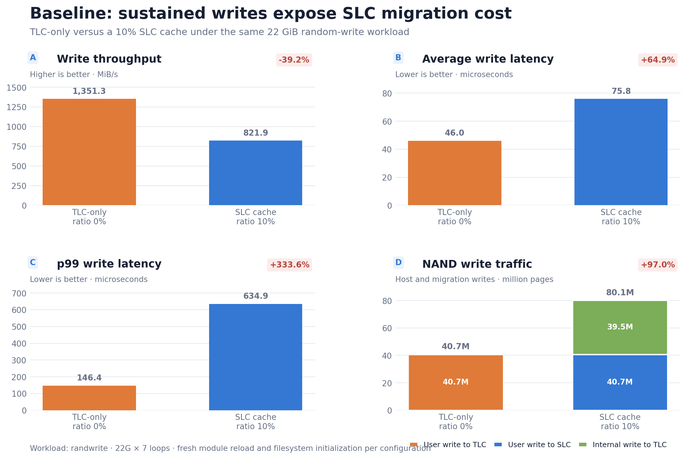
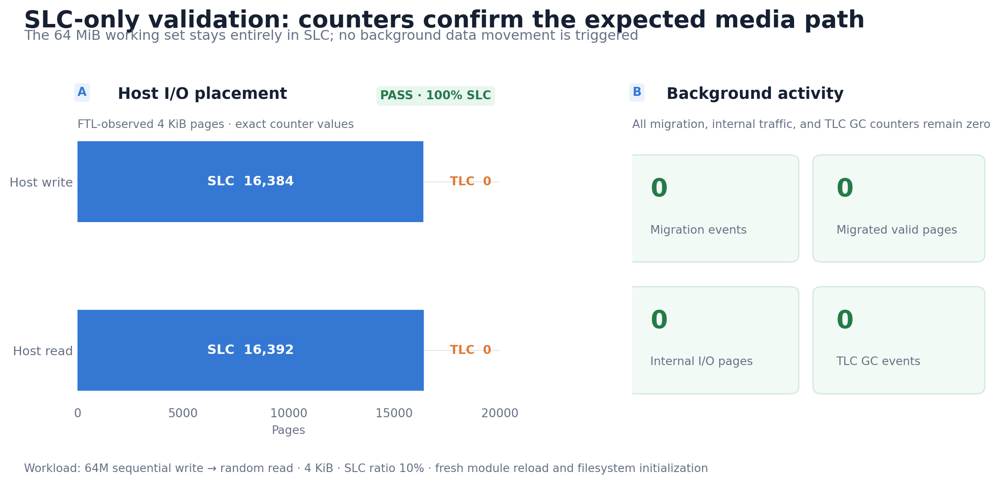
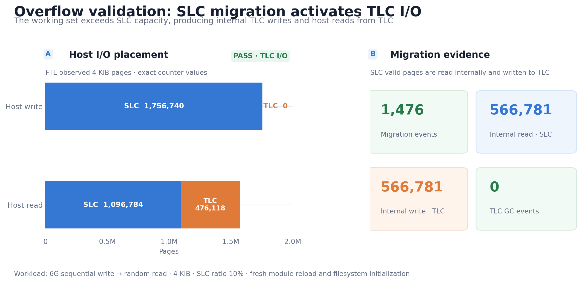
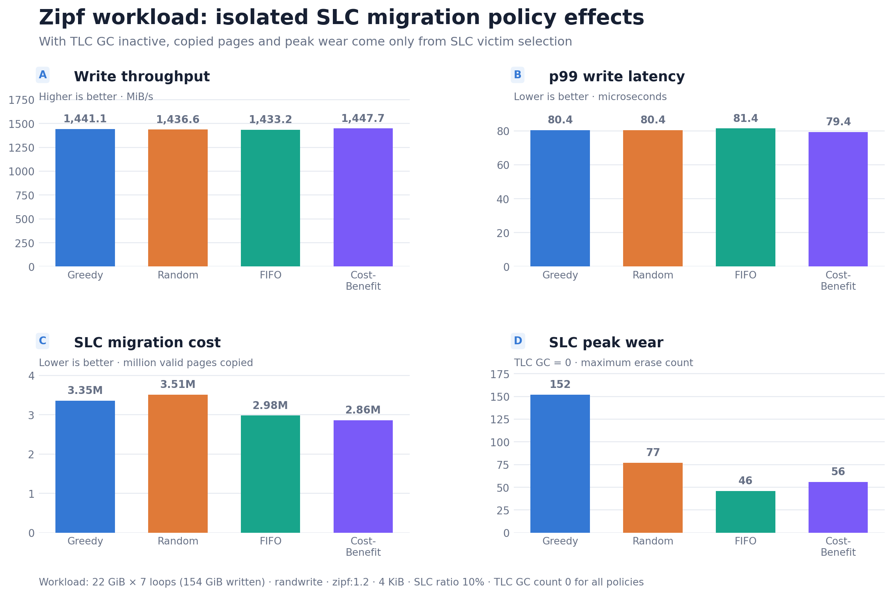
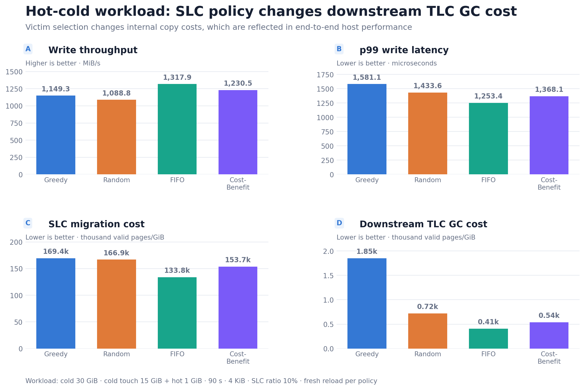

# 실습 2: NVMeVirt SLC Cache 구현 및 Migration 정책 분석

> 작성 상태: 전체 초안 작성 완료, 항목별 검토 및 편집 진행 중

## 1. 실습 목표

### 1.1 SLC Cache 구현 목표

본 실습의 첫 번째 목표는 NVMeVirt의 Conventional FTL에 SLC cache를 추가하는 것이다. Host write를 상대적으로 빠른 SLC 영역에서 우선 처리하고, SLC 공간이 부족해지면 아직 유효한 데이터를 TLC로 옮겨 SLC 공간을 다시 확보하도록 구현한다. 또한 최신 데이터가 SLC와 TLC 중 어느 곳에 있더라도 동일한 logical address로 정상적으로 읽을 수 있어야 한다.

구현의 정상 동작 여부는 SLC 용량을 기준으로 두 가지 조건에서 확인한다. SLC보다 작은 workload에서는 read/write가 SLC 안에서만 처리되어야 하며, SLC를 초과하는 workload에서는 SLC-to-TLC migration과 TLC read가 실제로 관찰되어야 한다. 마지막으로 SLC cache를 사용하지 않는 기존 Conventional FTL과 throughput 및 latency를 비교해 cache 적용에 따른 성능 변화를 평가한다.

### 1.2 SLC–TLC 이종 저장 구조

두 번째 목표는 하나의 SSD 공간을 SLC와 TLC line pool로 나누되, 두 영역을 독립적으로 할당하고 회수할 수 있는 구조를 만드는 것이다. SLC와 TLC는 별도의 line manager와 write pointer를 사용하며, 설정값으로 SLC 비율을 선택할 수 있어야 한다. 반면 logical-to-physical mapping은 하나만 유지해, 데이터가 migration된 뒤에도 동일한 mapping entry가 새 TLC 위치를 가리키도록 한다.

SLC와 TLC의 특성 차이도 timing model과 program unit에 반영한다. 본 구현은 TLC 32 KiB, SLC 16 KiB의 oneshot page size를 사용하고, SLC에는 LSB형 read timing과 TLC보다 짧은 program latency를 적용한다. 이를 통해 단순히 주소 범위만 나누는 것이 아니라 서로 다른 media 특성을 갖는 이종 저장 구조를 모델링한다.

### 1.3 Migration 정책 비교 목표

세 번째 목표는 SLC가 가득 찼을 때 회수할 victim line을 선택하는 Greedy, Random, FIFO, Cost-Benefit 정책을 구현하고 동일한 workload에서 비교하는 것이다. 정책의 직접적인 대상은 TLC 내부 GC가 아니라 **SLC-to-TLC migration victim**이다. 따라서 정책 비교에서는 TLC GC 정책을 Greedy로 고정하고 SLC migration 정책만 변경한다.

정책별 평가는 fio가 측정한 host write throughput과 latency뿐 아니라 migration 횟수, 이동한 valid page 수, block erase 분포를 함께 사용한다. 이를 통해 host 성능 차이가 작더라도 내부 복사 비용이나 마모 집중도에서 나타나는 정책 특성을 확인하고, workload의 접근 지역성이 정책 효과에 어떤 영향을 주는지 분석한다.

## 2. 구현 내용

### 2.1 SLC/TLC 영역 분할

`slc_cache_ratio_percent` 모듈 파라미터를 추가해 모듈 적재 시 SLC 비율을 지정하도록 했다. 기본값은 `ssd_config.h`의 `SLC_CACHE_RATIO_PERCENT=10`이며, 실험에서는 `0`과 `10`을 사용했다. 초기화 과정에서 전체 line 수에 비율을 적용해 앞쪽 line을 SLC pool, 나머지를 TLC pool로 고정 분할한다. `ratio=0`이면 SLC pool 없이 기존 TLC-only 경로가 사용된다.

각 line은 하나의 pool에만 속하며, SLC와 TLC에 대해 별도의 `line_mgmt` 구조체를 둔다. 두 manager는 각자의 free, full, victim line 상태를 독립적으로 관리하고, 회수된 line도 원래 pool의 free list로 돌아간다. Write pointer는 host SLC write용 `slc_wp`, TLC-only baseline의 host write용 `tlc_wp`, migration과 TLC GC의 내부 write용 `tlc_gc_wp`로 분리했다.

Program unit은 기존 TLC oneshot page 32 KiB와 SLC oneshot page 16 KiB로 구분했다. SLC page program latency는 기존 TLC program latency의 1/3로 설정하고, read에도 SLC 전용 latency를 적용했다. Write pointer 전진과 NAND command의 크기는 현재 PPA가 속한 pool의 oneshot page size를 기준으로 계산한다.

### 2.2 Host write 및 read 경로

SLC pool이 존재하면 모든 host write는 `slc_wp`가 가리키는 SLC line에 먼저 기록된다. `ratio=0`일 때만 host write가 `tlc_wp`를 통해 TLC로 직접 기록된다. Overwrite가 발생하면 기존 PPA가 SLC인지 TLC인지와 관계없이 이전 page를 invalid 처리한 뒤, 새 PPA로 공통 mapping table과 reverse mapping을 갱신한다.

Read는 별도의 SLC/TLC mapping table을 만들지 않고 기존의 단일 mapping table을 사용한다. Mapping 결과로 얻은 PPA의 line 범위를 검사해 SLC 또는 TLC media를 결정한 뒤 해당 timing으로 NAND read를 수행한다. 따라서 migration 전에는 SLC에 있는 최신 page를, migration 후에는 TLC로 이동한 최신 page를 같은 read 경로에서 처리할 수 있다.

### 2.3 SLC-to-TLC Migration

현재 SLC write line이 닫히는 시점에 다음 SLC free line이 없으면 foreground migration을 수행한다. 선택된 SLC victim에서 valid page만 읽어 TLC의 내부 write pointer로 복사하고, 각 LPN의 mapping과 reverse mapping을 새 TLC PPA로 갱신한다. 복사가 끝나면 victim을 erase하고 SLC manager의 free line으로 반환해 host write가 계속 진행될 수 있게 한다.

Migration과 TLC GC는 valid page 복사 및 line 회수 절차의 일부를 공유하지만, reclaim reason을 구분해 목적과 통계를 분리했다. 또한 destination인 TLC 공간이 부족한 victim은 선택하지 않으며, SLC migration 후에도 TLC GC 한 line을 수행할 수 있는 여유 공간을 남기는 reserve 방식의 admission control을 적용했다. 적합한 SLC victim이 없으면 TLC GC를 먼저 수행한 뒤 migration victim 선택을 다시 시도한다.

### 2.4 Migration victim 정책

#### 2.4.1 Greedy

현재 migration 가능한 SLC full/victim line 중 valid page count(`vpc`)가 가장 작은 line을 선택한다. 한 번의 migration에서 TLC로 복사해야 할 page 수를 국소적으로 최소화하는 정책이다. `vpc`가 같으면 먼저 닫힌 line을 선택해 결과가 결정적이도록 했다.

#### 2.4.2 Random

현재 TLC 수용 가능 조건을 만족하는 모든 SLC 후보를 모아 균등 무작위로 하나를 선택한다. 무작위 priority를 heap에 저장하면 자료구조의 정렬 조건이 깨질 수 있으므로, 후보 수를 센 뒤 무작위 인덱스에 해당하는 line을 직접 선택하는 방식으로 구현했다.

#### 2.4.3 FIFO

각 line이 닫힐 때 증가하는 `close_seq`를 기록하고, 값이 가장 작은, 즉 가장 먼저 닫힌 SLC line을 선택한다. 실제 wall-clock 대신 논리적인 close 순서를 사용하므로 시스템 스케줄링과 무관하게 동일한 입력에서 재현 가능한 선택을 얻을 수 있다.

#### 2.4.4 Cost-Benefit

Cost-Benefit은 line의 invalid page 수(`ipc`), valid page 수(`vpc`), age를 함께 고려한다. 구현에 사용한 점수는 다음과 같으며, 점수가 큰 line을 우선 선택한다.

\[
\text{Cost-Benefit score} = \frac{ipc \times age}{2 \times vpc}
\]

여기서 `age = cb_clock - mtime`이며, `mtime`은 line이 닫힐 때의 논리 clock 값이다. `vpc=0`인 line은 복사 비용이 없으므로 즉시 최우선 victim으로 처리한다. Age가 계속 증가하면 후보의 상대 순서도 시간에 따라 달라지므로, 오래전에 구성된 heap의 root를 그대로 사용하지 않고 victim 선택 시점마다 전체 후보의 현재 점수를 다시 계산한다.

### 2.5 TLC GC와 SLC Migration의 분리

기존 `gc_policy`는 TLC 내부 GC victim 정책으로 유지하고, 새 `slc_migration_policy`를 SLC migration 전용 파라미터로 추가했다. 두 파라미터는 모듈 적재 시에만 설정하도록 읽기 전용으로 두었다. 정책 비교 중에는 `gc_policy=0`으로 TLC GC를 Greedy에 고정하고 `slc_migration_policy=0/1/2/3`만 변경했다.

두 reclaim의 데이터 이동 방향도 다르다. SLC migration은 SLC cache 공간 확보를 위한 **SLC-to-TLC** 복사이고, TLC GC는 TLC 내부 free space 확보를 위한 **TLC-to-TLC** 복사다. Counter도 `SLC_MIGRATION_*`와 `TLC_GC_*`로 분리해 어느 동작이 내부 I/O와 latency에 영향을 주었는지 구분할 수 있게 했다.

### 2.6 통계 및 검증 기능

`/proc/nvmev/debug`에 host와 internal I/O를 SLC/TLC별로 나눈 page counter를 추가했다. 주요 항목은 host read/write page, internal read/write page, SLC migration 횟수와 migrated valid page, TLC GC 횟수와 migrated valid page, 블록별 erase count다. 실험 시작 전 `reset`을 기록하면 관련 counter를 초기화할 수 있다.

실험 스크립트는 fio JSON 원본, 모듈 및 workload 설정, debug counter와 erase count를 결과 디렉터리에 함께 저장한다. 기능 검증에서는 fio job의 `error=0`과 media별 counter의 일치 여부를 확인했으며, 별도의 CRC32C read-back 실험에서는 네 migration 정책 모두 migration과 TLC GC가 발생한 조건에서 데이터 불일치 없이 완료됐다.

## 3. 실험 방법

### 3.1 실험 환경

실험은 Linux kernel 6.18과 GCC 15를 사용하는 서버에서 수행했다. NVMeVirt 모듈은 `memmap_start=16G`, `memmap_size=48G`, `cpus=7,8`로 적재했으며, 약 44.86 GiB의 가상 Conventional SSD가 `/dev/nvme1n1`로 생성됐다. 파일시스템은 ext4를 사용했다.

| 항목 | 설정 |
|---|---|
| NVMeVirt FTL | Conventional FTL |
| 가상 SSD 설정 | `memmap_start=16G`, `memmap_size=48G`, `cpus=7,8` |
| 노출 용량 | 약 44.86 GiB |
| 파일시스템 | ext4 |
| Benchmark | fio, `libaio`, `direct=1`, `iodepth=16` |
| I/O block size | 4 KiB |
| SLC 비율 | 기본 10%, baseline에서 0%와 비교 |
| TLC GC 정책 | Greedy(`gc_policy=0`) 고정 |
| SLC migration 정책 | Greedy, Random, FIFO, Cost-Benefit |

`direct=1`로 page cache의 영향을 줄였고, 성능값과 counter는 fio 종료 후 수집했다. SLC-only와 overflow의 read phase도 같은 4 KiB, `libaio`, `iodepth=16`, `direct=1` 조건을 사용했다.

### 3.2 공통 실행 및 초기화 절차

정책과 SLC 비율을 바꾸는 모든 비교는 다음 순서로 독립 실행했다.

1. 기존 파일시스템을 unmount하고 NVMeVirt 모듈을 제거한다.
2. 비교할 `slc_cache_ratio_percent`와 `slc_migration_policy`를 지정해 모듈을 다시 적재한다.
3. 가상 SSD에 ext4 파일시스템을 새로 생성하고 mount한다.
4. `/proc/nvmev/debug` counter를 reset한다.
5. fio workload를 실행하고 JSON 결과와 debug counter를 저장한다.

모듈을 완전히 리로드한 이유는 파일시스템만 재생성해도 write pointer, free/victim line, 논리 clock 등의 FTL 내부 상태는 남기 때문이다. Fresh reload를 통해 각 정책이 동일한 초기 media 상태에서 시작하도록 했으며, 이전 정책의 배치와 마모 상태가 다음 측정에 섞이는 것을 방지했다.

### 3.3 정상 동작 검증 방법

SLC cache 구현은 baseline, SLC-only, overflow의 세 단계로 검증했다.

| 구분 | 조건 | 확인 목적 |
|---|---|---|
| Baseline | 22 GiB 4 KiB random write를 7회 반복, ratio 0%와 10% 비교 | 기존 TLC-only 대비 throughput, latency 및 내부 write traffic 비교 |
| SLC-only | 64 MiB sequential write 후 동일 파일 random read | SLC 용량 이내에서 host read/write가 SLC에만 발생하는지 확인 |
| Overflow | 6 GiB sequential write 후 동일 파일 random read | SLC migration, TLC internal write 및 migration 이후 TLC read 확인 |

Baseline은 동일한 모듈에서 SLC 비율만 `0`과 `10`으로 변경한 통제 비교다. `ratio=0`을 기존 Conventional FTL에 해당하는 TLC-only 조건으로 사용했다. Baseline은 지속적인 write 부하에서 공식 평가 요소인 throughput과 latency를 비교하며, SLC-only와 overflow는 성능 우열보다 media별 counter가 예상 경로와 일치하는지를 중심으로 평가했다.

### 3.4 정책 비교 워크로드

정책 차이를 보기 위해 접근 지역성이 다른 Zipf와 Hot-cold workload를 사용했다. 두 실험 모두 `slc_cache_ratio_percent=10`, `gc_policy=0`으로 고정하고 SLC migration 정책만 변경했다.

Zipf 실험은 22 GiB 파일에 `random_distribution=zipf:1.2`, `norandommap=1`을 적용한 4 KiB random write를 7회 반복했다. 정책마다 총 154 GiB를 동일하게 기록하므로 성능과 raw migration/erase counter를 직접 비교할 수 있다. `norandommap`은 한 pass에서 모든 block을 한 번씩 방문하는 fio의 기본 random map 효과를 제거해, 중복 접근이 가능한 skewed random workload를 만들기 위해 사용했다.

Hot-cold 실험은 먼저 30 GiB cold 파일을 순차 기록한 다음, 그중 15 GiB 영역의 random write와 별도의 1 GiB hot 파일 random write를 90초 동안 동시에 수행했다. Cold 후보와 hot churn이 실행 전 구간에 함께 존재하도록 두 job을 같은 runtime으로 설정했다. 시간 기반 workload에서는 정책 성능에 따라 총 기록량이 달라지므로 migration page, TLC GC page, erase 횟수는 기록한 GiB로 나눠 정규화했다.

### 3.5 측정 지표

측정 지표는 다음과 같이 성능, 기능, 내부 비용, 마모도로 구분했다.

- Host 성능: write/read throughput, IOPS, 평균 latency, p99 completion latency
- SLC cache 경로: SLC/TLC별 host read/write page 수
- SLC migration 비용: migration 횟수, SLC에서 TLC로 이동한 valid page 수
- Downstream TLC GC 비용: TLC GC 횟수, TLC GC가 다시 이동한 valid page 수
- 마모도: 전체 erase 합계, block당 최대 erase, 전체 block 기준 erase count 변동계수(CV)

Migration 횟수만으로는 한 번에 복사한 page 수를 알 수 없으므로 migrated valid page를 핵심 비용 지표로 사용했다. Hot-cold처럼 실행량이 다른 경우에는 page/GiB와 erase/GiB를 함께 계산했다. 또한 fio latency는 migration 함수 한 번의 시작과 종료를 직접 측정한 값이 아니라, 내부 migration과 TLC GC의 자원 점유 영향을 포함한 host I/O의 end-to-end latency로 해석했다.

## 4. 실험 결과

### 4.1 Baseline: TLC-only와 SLC Cache 비교

실험 목적은 동일한 빌드 산출물에서 `slc_cache_ratio_percent`만 `0`과 `10`으로 바꿨을 때, 기본 랜덤쓰기 workload의 성능과 내부 write traffic이 어떻게 달라지는지 확인하는 것이다.

- 환경: `memmap_start=16G`, `memmap_size=48G`, `cpus=7,8`
- workload: `randwrite`, `BASELINE_SIZE=22G`, `BASELINE_LOOPS=7`
- 실행 방식: 각 조건마다 `umount -> rmmod -> insmod -> mkfs -> mount`의 fresh reload
- 결과 디렉터리:
  - `ratio=0`: `results/local_20260828_113345_slc_baseline_compare/tlc_only/`
  - `ratio=10`: `results/local_20260828_113345_slc_baseline_compare/slc_on/`

| Ratio | Write BW (MiB/s) | Write IOPS | Avg Latency (us) | p99 Latency (us) | SLC Migration Cnt | SLC Migrated Pages | TLC GC Cnt |
|---|---:|---:|---:|---:|---:|---:|---:|
| `0` (TLC-only) | 1,351.3 | 345,940 | 46.0 | 146.4 | 0 | 0 | 73,332 |
| `10` (SLC cache) | 821.9 | 210,410 | 75.8 | 634.9 | 102,812 | 39,472,631 | 73,308 |

내부 page traffic도 크게 갈린다. `ratio=0`에서는 host write가 전부 TLC로 직접 기록되며 `user_write_tlc_pages=40,673,368`, `internal_write_tlc_pages=0`이다. 반면 `ratio=10`에서는 host write가 거의 전부 SLC에 먼저 기록되고(`user_write_slc_pages=40,670,348`), 그 뒤 유효 페이지 `39,472,631`개가 TLC로 migration되었다(`internal_write_tlc_pages=39,472,631`).

이 결과는 이번 baseline 조건이 SLC cache의 이점을 보는 workload라기보다, SLC overflow와 migration 비용을 강하게 드러내는 workload였음을 보여준다. `ratio=10`은 host write를 더 빠른 SLC에 먼저 기록했지만, working set이 SLC 용량을 지속적으로 넘어서면서 거의 동일한 양의 데이터를 다시 TLC로 옮겨야 했다. 그 결과 내부 write amplification이 크게 증가했고, throughput은 `1,351.3 -> 821.9 MiB/s`로 감소했으며 p99 latency는 `146.4 -> 634.9 us`로 악화되었다.

이 baseline 비교는 "SLC cache는 항상 빠르다"는 결론이 아니라, "SLC cache는 overflow가 적고 hot data가 캐시에 머무르는 조건에서 유리하며, sustained write로 migration이 계속 발생하면 오히려 손해가 날 수 있다"는 점을 보여주는 근거로 해석하는 편이 맞다.

### 4.2 SLC-only 동작 검증

SLC cache 용량보다 작은 working set을 기록하고 다시 읽었을 때, host I/O가 TLC로 내려가지 않고 SLC에서만 처리되는지 확인했다. 이 실험은 정책 간 성능 비교가 아니라 SLC read/write 경로와 media별 계측값의 정상 동작을 검증하는 것이 목적이다.

- 환경: `memmap_start=16G`, `memmap_size=48G`, `cpus=7,8`
- 설정: `slc_cache_ratio_percent=10`, `FILE_SIZE=64M`
- write phase: 4 KiB sequential write, `iodepth=16`, `direct=1`
- read phase: 동일 파일에 대한 4 KiB random read, `iodepth=16`, `direct=1`
- 실행 방식: 모듈 리로드와 파일시스템 재생성 후 write와 read를 순서대로 실행
- 결과 디렉터리: `results/local_20260827_192113_slc_only_validation/`

| 검증 지표 | SLC pages | TLC pages |
|---|---:|---:|
| Host write | 16,384 | 0 |
| Host read | 16,392 | 0 |
| Internal write | 0 | 0 |
| Internal read | 0 | 0 |

64 MiB 파일의 host write 16,384페이지는 모두 SLC에 기록됐고, 이어진 host read 16,392페이지도 모두 SLC에서 처리됐다. 64 MiB를 4 KiB 단위로 나눈 데이터 페이지 수는 16,384개이며, read에서 추가로 관찰된 8페이지는 파일시스템 메타데이터 접근으로 해석된다. 중요한 점은 데이터와 메타데이터 접근을 포함한 모든 host read/write가 SLC로만 향했고 `USER_WRITE_TLC_PAGES`와 `USER_READ_TLC_PAGES`가 모두 0이었다는 것이다.

또한 `SLC_MIGRATION_CNT=0`, `TLC_GC_CNT=0`이었으며 internal read/write도 전부 0이었다. 따라서 working set이 SLC cache 안에 머무르는 동안에는 별도의 migration이나 TLC 접근 없이 SLC read/write 경로만 사용됨을 확인했다.

기능 검증에 사용한 fio workload의 성능 측정값은 다음과 같다. 이 값은 정상적으로 I/O가 완료됐음을 함께 기록하기 위한 참고값이며, 서로 다른 workload를 사용한 baseline과 직접 비교하지 않는다.

| Phase | BW (MiB/s) | IOPS | Avg Latency (us) | p99 Latency (us) |
|---|---:|---:|---:|---:|
| Sequential write | 780.5 | 199,805 | 79.1 | 144.4 |
| Random read | 831.2 | 212,779 | 74.1 | 150.5 |

### 4.3 SLC Overflow 및 Migration 검증

SLC cache 용량보다 큰 working set을 기록해 cache overflow를 유도한 뒤, SLC-to-TLC migration과 TLC에 위치한 데이터의 read가 실제로 발생하는지 확인했다. 이 실험의 핵심은 throughput의 절대값이 아니라 host/internal I/O counter가 `Host write -> SLC -> migration -> TLC -> Host read` 경로를 보여주는지 검증하는 것이다.

- 환경: `memmap_start=16G`, `memmap_size=48G`, `cpus=7,8`
- 설정: `slc_cache_ratio_percent=10`, `FILE_SIZE=6G`
- write phase: 4 KiB sequential write, `iodepth=16`, `direct=1`
- read phase: 동일 파일에 대한 4 KiB random read, `iodepth=16`, `direct=1`
- 실행 방식: 모듈 리로드와 파일시스템 재생성 후 write와 read를 순서대로 실행
- 결과 디렉터리: `results/local_20260827_193407_slc_overflow_validation/`

| 검증 지표 | SLC pages | TLC pages |
|---|---:|---:|
| Host write | 1,756,740 | 0 |
| Host read | 1,096,784 | 476,118 |
| Internal read | 566,781 | 0 |
| Internal write | 0 | 566,781 |

| Migration/GC 지표 | 측정값 |
|---|---:|
| SLC migration 횟수 | 1,476 |
| Migration된 valid page | 566,781 |
| TLC GC 횟수 | 0 |
| TLC GC migration page | 0 |

host write 1,756,740페이지는 모두 SLC에 먼저 기록됐고 TLC로 직접 기록된 host write는 없었다. SLC 공간이 부족해지자 migration이 1,476회 발생했으며, SLC에서 internal read된 566,781페이지가 TLC에 internal write됐다. 두 internal counter가 migration된 valid page 수와 정확히 일치하므로, 유효 데이터를 SLC에서 읽어 TLC로 복사하는 migration 경로가 의도대로 동작했음을 확인할 수 있다.

이후 random read에서는 1,096,784페이지가 SLC에서, 476,118페이지가 TLC에서 처리됐다. 즉 migration 이후 mapping이 TLC를 가리키는 데이터도 host가 정상적으로 읽었다. 또한 `TLC_GC_CNT=0`이므로 이 실험에서 관찰된 TLC internal write는 TLC GC가 아니라 SLC-to-TLC migration에 의해 발생한 것으로 구분할 수 있다. write와 read fio job의 `error`도 모두 0이었다.

기능 검증 workload의 성능 측정값은 다음과 같다. SLC-only와 마찬가지로 실험 수행 상태를 기록하기 위한 참고값이며, workload 크기가 다른 baseline 또는 SLC-only와 직접 비교하지 않는다.

| Phase | BW (MiB/s) | IOPS | Avg Latency (us) | p99 Latency (us) |
|---|---:|---:|---:|---:|
| Sequential write | 872.7 | 223,418 | 71.4 | 191.5 |
| Random read | 811.3 | 207,694 | 76.9 | 160.8 |

### 4.4 Zipf 워크로드 정책 비교

지역성이 있는 random write에서 네 migration victim 정책의 성능, migration 비용, 마모 분포를 비교했다. 모든 정책은 동일하게 22 GiB 파일을 7회 반복 기록해 총 154 GiB를 썼으므로 raw counter를 직접 비교할 수 있다.

- workload: 4 KiB `randwrite`, `iodepth=16`, `direct=1`
- 파일 크기 및 반복: `22G x 7 loops` (총 154 GiB)
- 접근 분포: `zipf:1.2`, `norandommap=1`
- 설정: `slc_cache_ratio_percent=10`, `tlc_gc_policy=0`
- 비교 정책: Greedy, Random, FIFO, Cost-Benefit
- 실행 방식: 정책마다 모듈 리로드와 파일시스템 재생성

| Policy | BW (MiB/s) | IOPS | Avg Latency (us) | p99 Latency (us) |
|---|---:|---:|---:|---:|
| Greedy | 1,441.1 | 368,920 | 43.0 | 80.4 |
| Random | 1,436.6 | 367,761 | 43.2 | 80.4 |
| FIFO | 1,433.2 | 366,908 | 43.3 | 81.4 |
| Cost-Benefit | 1,447.7 | 370,620 | 42.9 | 79.4 |

| Policy | Migration cnt | Migrated pages | Erase sum | Erase max | Erase CV (all) | TLC GC cnt |
|---|---:|---:|---:|---:|---:|---:|
| Greedy | 102,935 | 3,354,895 | 411,740 | 152 | 4.9402 | 0 |
| Random | 102,958 | 3,509,797 | 411,832 | 77 | 3.1671 | 0 |
| FIFO | 102,958 | 2,979,471 | 411,832 | **46** | **3.1165** | 0 |
| Cost-Benefit | 102,934 | **2,858,608** | 411,736 | 56 | 3.2169 | 0 |

네 정책의 host 성능은 거의 같았다. throughput 범위는 1,433.2~1,447.7 MiB/s로 최댓값과 최솟값의 차이가 약 1.0%였고, 평균 latency는 42.9~43.3 us, p99 latency는 79.4~81.4 us였다. 따라서 이 조건에서는 victim 선택 정책의 계산 및 선택 차이가 host latency의 큰 차이로 나타나지 않았다. 이 latency는 migration 자체의 실행시간이 아니라 fio가 관찰한 host write의 end-to-end latency이며, 이 workload에서는 TLC GC가 0이므로 내부 reclaim 영향은 SLC migration으로 한정된다.

반면 migration 비용과 마모 집중도에서는 정책 차이가 분명했다. migrated page는 `Cost-Benefit < FIFO < Greedy < Random` 순서였으며, Cost-Benefit은 Greedy보다 14.8% 적은 valid page를 이동했다. FIFO도 Greedy보다 11.2% 적게 이동했다. 네 정책의 erase sum은 약 411.7K로 사실상 같았지만 erase max는 Greedy 152, Random 77, FIFO 46, Cost-Benefit 56으로 크게 달랐다. FIFO는 가장 낮은 peak wear와 전체 블록 기준 erase CV를 기록해 마모가 특정 블록에 집중되는 현상을 가장 잘 완화했다.

네 정책 모두 `TLC_GC_CNT=0`이므로 위 차이는 TLC GC policy가 아니라 SLC migration victim policy에서 발생한 결과로 해석할 수 있다. Zipf 조건에서는 Cost-Benefit이 migration 비용을 최소화했고, FIFO가 peak wear를 최소화했다.

### 4.5 Hot-cold 워크로드 정책 비교

두 번째 정책 비교에서는 큰 cold 영역과 반복 갱신되는 hot 영역을 동시에 사용해 데이터 온도 차이가 victim 선택에 미치는 영향을 확인했다. cold 파일을 채운 뒤 cold 영역 일부의 write와 작은 hot 파일의 반복 write를 90초 동안 함께 수행했다. 이 workload는 시간 기반이므로 정책마다 실제 기록량이 다르며, migration과 erase 총량은 기록한 GiB로 정규화해 비교했다.

- cold 영역: 30 GiB, cold touch 영역: 15 GiB
- hot 영역: 1 GiB
- 동시 write 시간: 90초
- block size: 4 KiB
- 설정: `slc_cache_ratio_percent=10`, `tlc_gc_policy=0`
- 비교 정책: Greedy, Random, FIFO, Cost-Benefit
- 실행 방식: guarded/reserve admission control 적용 후 정책마다 fresh reload

| Policy | Written (GiB) | BW (MiB/s) | IOPS | Avg Latency (us) | p99 Latency (us) |
|---|---:|---:|---:|---:|---:|
| Greedy | 108.3 | 1,149.3 | 294,227 | 155.6 | 1,581.1 |
| Random | 112.6 | 1,088.8 | 278,739 | 154.7 | 1,433.6 |
| FIFO | 118.5 | **1,317.9** | **337,379** | **139.9** | **1,253.4** |
| Cost-Benefit | 113.7 | 1,230.5 | 315,007 | 147.2 | 1,368.1 |

| Policy | Migration cnt | SLC migrated pages | SLC pages/GiB |
|---|---:|---:|---:|
| Greedy | 71,448 | 18,352,180 | 169,446 |
| Random | 74,134 | 18,794,946 | 166,931 |
| FIFO | 78,414 | **15,852,568** | **133,755** |
| Cost-Benefit | 74,760 | 17,472,902 | 153,699 |

| Policy | TLC GC cnt | TLC GC migrated pages | TLC GC pages/GiB | Erase/GiB | Erase max |
|---|---:|---:|---:|---:|---:|
| Greedy | 18,828 | 200,354 | 1,851 | 3,334 | 41 |
| Random | 19,670 | 81,248 | 722 | 3,333 | 42 |
| FIFO | **11,922** | **48,450** | **409** | **3,049** | **25** |
| Cost-Benefit | 16,177 | 61,382 | 540 | 3,200 | 31 |

Hot-cold에서는 FIFO가 네 가지 핵심 지표에서 모두 가장 좋았다. throughput은 1,317.9 MiB/s로 가장 높았고, 평균 및 p99 latency도 각각 139.9 us와 1,253.4 us로 가장 낮았다. Greedy와 비교하면 throughput은 14.7% 높고 p99 latency는 20.7% 낮았다. Cost-Benefit은 모든 성능 지표에서 FIFO 다음이었다. 여기서 fio latency는 migration 한 번의 시작부터 종료까지 걸린 시간이 아니라, migration과 TLC GC의 NAND 자원 점유 영향을 포함한 host write 요청의 end-to-end latency다.

시간 기반 실행량을 보정한 migration 비용도 FIFO가 가장 낮았다. FIFO는 GiB당 133,755페이지를 이동해 Greedy보다 21.1%, Cost-Benefit보다 13.0% 적었다. FIFO의 migration 횟수 자체는 78,414회로 가장 많았지만 총 migrated page는 가장 적었다. 이는 FIFO가 migration을 더 자주 수행했더라도 한 victim에서 복사한 valid page 수가 상대적으로 적었음을 의미한다.

SLC migration policy는 이후 TLC의 데이터 배치와 GC 비용도 바꿨다. TLC GC가 다시 이동한 valid page는 GiB당 Greedy 1,851, Random 722, FIFO 409, Cost-Benefit 540페이지였다. 이 downstream TLC GC copy cost의 순위는 p99 latency 순위와 동일하게 `FIFO < Cost-Benefit < Random < Greedy`였다. TLC GC 횟수도 FIFO가 11,922회로 가장 낮았고, GiB당 erase와 erase max도 각각 3,049와 25로 최소였다. 따라서 이 Hot-cold 조건에서는 FIFO가 SLC migration write amplification과 downstream TLC GC pressure를 함께 줄였으며, 그 결과 host throughput과 tail latency까지 개선한 것으로 해석할 수 있다.

Random과 Greedy의 wear 결과는 지표에 따라 방향이 달랐다. GiB당 erase는 Random 3,332.5, Greedy 3,334.1로 차이가 0.05% 미만이어서 사실상 같고, peak erase는 Random 42로 Greedy 41보다 오히려 한 번 높았다. 반면 전체 블록 erase CV는 Random 2.3621, Greedy 2.4388이고 erase가 발생한 블록 수도 Random 91,780개, Greedy 88,416개였다. Random이 victim을 더 넓은 범위에서 선택하면서 마모 분포를 조금 더 넓게 퍼뜨렸지만 최대 마모나 총 마모를 개선한 것은 아니라는 뜻이다. 따라서 Random을 모든 지표에서 항상 최악이라고 가정하기보다, migration 효율과 wear concentration 사이의 trade-off로 해석해야 한다.

Greedy의 p99 latency가 Random보다 높았던 데에는 downstream TLC GC 비용도 영향을 준 것으로 보인다. TLC GC가 이동한 valid page는 Greedy 200,354페이지, Random 81,248페이지였다. SLC migration victim 선택이 이후 TLC의 데이터 배치와 GC 후보 상태를 바꾸므로, 매 순간 복사할 SLC valid page가 적은 victim을 고르는 Greedy가 전체 실행에서도 항상 가장 낮은 tail latency를 보장하지는 않는다.

다만 이 서버 Hot-cold 결과는 정책별 1회 측정이며 시간 기반 workload다. 기록량 차이는 GiB 정규화로 보정했지만 반복 측정에 따른 분산은 제공하지 못하므로, 정책 순위는 이 실험 조건에서 관찰된 결과로 한정해 해석한다.

## 5. 분석

### 5.1 SLC Cache의 효과와 Migration 비용

SLC-only와 overflow 결과는 구현의 데이터 경로가 과제 요구사항대로 동작함을 단계적으로 보여준다. 64 MiB 조건에서는 host write와 read가 모두 SLC에서 처리되고 migration 및 TLC GC가 전혀 발생하지 않았다. 반면 6 GiB overflow 조건에서는 host write가 계속 SLC로 들어간 뒤 566,781개의 valid page가 SLC에서 읽혀 TLC에 기록됐고, 이후 host가 TLC의 476,118페이지를 정상적으로 읽었다. 즉 cache 크기 안에서는 SLC-only 경로를, cache가 찬 뒤에는 `SLC write -> SLC-to-TLC migration -> TLC read` 경로를 각각 확인했다.

성능 측면에서 SLC cache의 효과는 workload가 cache에 얼마나 오래 머무르는지에 따라 달라졌다. Baseline의 154 GiB 지속 random write에서 SLC-on은 host write 약 40.67M page를 SLC에서 처리했지만, 그중 약 39.47M page를 다시 TLC로 옮겼다. Host write 대비 migration page가 약 97%에 달해 SLC의 빠른 program latency보다 추가 read/write와 foreground reclaim 비용이 더 크게 작용했다. 그 결과 TLC-only보다 throughput이 낮고 평균 및 p99 latency가 높았다.

따라서 본 결과는 SLC cache 자체가 항상 성능을 높인다는 의미가 아니다. Working set이 SLC 안에 머물거나 overwrite로 빠르게 invalid되는 burst workload에서는 SLC의 장점을 기대할 수 있지만, 지속적인 write가 cache를 반복해서 채우면 migration write amplification과 tail latency가 증가할 수 있다.

### 5.2 워크로드에 따른 정책별 특성

Zipf에서는 네 정책의 host throughput 차이가 약 1%에 불과했지만 내부 비용에서는 차이가 나타났다. Cost-Benefit이 이동한 valid page 수를 가장 적게 만들었고, FIFO는 Cost-Benefit 다음으로 migration 비용이 낮으면서 peak erase와 전체 block erase CV를 최소화했다. TLC GC가 네 정책 모두 0이었으므로 이 결과는 SLC migration victim 선택만의 효과를 비교한 것으로 볼 수 있다.

Hot-cold에서는 정책이 이후 TLC 상태까지 바꾸면서 성능 차이가 더 크게 나타났다. FIFO는 SLC migrated page/GiB와 TLC GC copied page/GiB를 모두 최소화했고, 가장 높은 throughput과 가장 낮은 평균 및 p99 latency를 기록했다. Cost-Benefit이 그 다음이었으며, Greedy는 매 migration 순간의 최소 `vpc`를 선택했음에도 downstream TLC GC copy가 가장 많아 p99 latency가 가장 높았다.

두 workload의 결과를 함께 보면 단일 정책이 모든 조건과 모든 지표에서 항상 우월하지 않다. Zipf에서는 age와 utilization을 함께 고려한 Cost-Benefit이 직접 migration 비용에 유리했고, 명시적으로 분리된 hot/cold 영역에서는 오래된 line을 우선하는 FIFO가 SLC와 TLC 양쪽의 reclaim 비용을 함께 줄였다. 정책 평가는 host 성능뿐 아니라 접근 분포와 downstream 배치까지 포함해야 한다.

### 5.3 Migration 비용과 마모도의 관계

Migration 횟수, migrated page, erase 횟수는 서로 관련되지만 같은 의미의 지표는 아니다. Hot-cold에서 FIFO는 migration 횟수가 78,414회로 가장 많았지만 이동한 page/GiB는 가장 적었다. 즉 victim을 자주 회수하더라도 매번 복사할 valid page가 적으면 전체 migration 비용은 낮을 수 있으므로, 횟수만으로 정책 효율을 판단해서는 안 된다.

Erase 합계는 전체 write 양의 영향을 크게 받는 반면 erase max와 CV는 마모가 특정 block에 얼마나 집중됐는지를 보여준다. Zipf에서 정책별 erase 합계는 거의 같았지만 최대 erase는 Greedy 152와 FIFO 46으로 큰 차이가 났다. FIFO와 Random은 victim 선택 대상을 더 넓게 분산해 Greedy보다 peak wear를 낮췄지만, Random은 migration page가 가장 많아 복사 효율을 희생했다.

또한 SLC migration 비용만 낮다고 전체 write amplification이 최소가 되는 것은 아니다. Hot-cold에서는 SLC에서 TLC로 옮긴 데이터가 이후 TLC GC의 후보 구성을 바꾸었고, 정책별 TLC GC valid-page copy 차이가 host p99 latency 순위와 같은 방향으로 나타났다. 따라서 SLC victim 정책은 현재 migration의 복사 비용과 이후 TLC 배치 및 GC 비용을 함께 고려해 평가해야 한다.

### 5.4 정책별 장단점

| 정책 | 선택 기준 | 장점 | 관찰된 한계 |
|---|---|---|---|
| Greedy | 최소 valid page 수 | 현재 한 번의 migration 복사량을 직접 최소화 | 국소 최적 선택이 downstream TLC GC나 peak wear의 최소를 보장하지 않음 |
| Random | 적합한 후보 중 균등 무작위 | 특정 기준에 편향되지 않고 선택 범위를 넓힘 | 결과 변동 가능성이 있고 Zipf에서 migration page가 가장 많았음 |
| FIFO | 가장 먼저 닫힌 line | 단순하고 재현 가능하며, 본 Hot-cold에서 성능·복사 비용·peak wear가 가장 우수 | Zipf의 최소 migration page는 Cost-Benefit보다 많았음 |
| Cost-Benefit | invalid 비율과 age 결합 | Zipf에서 migration page 최소, Hot-cold에서도 FIFO 다음의 성능 | 동적 age 때문에 선택 시 전체 후보 재평가가 필요하며, 그 탐색 비용은 별도로 측정하지 않음 |

이번 실험에서는 FIFO가 가장 안정적인 종합 결과를 보였지만, 이는 사용한 Zipf와 Hot-cold 조건에서의 관찰이다. Cache 크기, 접근 skew, hot/cold 영역의 수명, TLC 여유 공간이 달라지면 정책의 순위도 달라질 수 있다.

### 5.5 실험의 한계

최종 서버 결과는 각 조건과 정책당 1회의 성공 run을 사용했으므로 반복 측정의 평균과 표준편차를 제시하지 못했다. 특히 Random은 선택 자체가 확률적이므로 여러 seed와 반복 run을 통한 분산 확인이 필요하다. Hot-cold 결과는 기록량을 GiB 기준으로 정규화했지만, 시간 기반 job에서 정책별 실행 경로와 I/O 간섭이 완전히 동일하다고 볼 수는 없다.

Baseline은 sustained random write 성능 비교이고, SLC-only와 overflow는 sequential write 후 random read를 사용한 기능 검증이다. 따라서 세 실험의 throughput과 latency 절대값을 서로 직접 비교하지 않았다. 또한 SLC 비율은 주로 10%만 사용했고, TLC GC 정책은 Greedy로 고정했으므로 다양한 cache 비율이나 SLC 정책과 TLC 정책의 조합까지 탐색하지 못했다.

측정값은 NVMeVirt의 timing model에서 얻은 결과이므로 실제 NAND device의 firmware, 병렬성, thermal throttling, background task를 모두 반영하지 않는다. Fio latency도 migration 자체의 구간별 시간을 직접 계측한 값이 아니다. 향후에는 migration 시작·종료 latency counter, 반복 실험, 더 다양한 SLC 비율과 workload, 실제 장치 또는 추가 simulator 설정을 통해 결과의 일반성을 확인할 필요가 있다.

## 6. 결론

본 실습에서는 NVMeVirt Conventional FTL에 설정 가능한 SLC cache를 구현하고, SLC와 TLC를 별도 line manager 및 write pointer로 관리했다. Host write를 SLC에서 우선 처리하고 공통 mapping을 통해 SLC/TLC read를 통합했으며, SLC가 가득 차면 valid page를 TLC로 이동한 뒤 SLC line을 회수하도록 했다. 또한 Greedy, Random, FIFO, Cost-Benefit의 네 SLC migration victim 정책을 구현하고 TLC GC 정책 및 통계를 분리했다.

기능 실험에서는 SLC 용량 이내의 read/write가 모두 SLC에서 처리되고, overflow 시 SLC-to-TLC migration과 migration 이후 TLC read가 정상적으로 발생함을 counter로 확인했다. 기존 TLC-only와의 비교에서는 지속적인 overflow로 host write의 약 97%에 해당하는 page가 다시 migration되면서 SLC cache의 throughput과 latency가 오히려 악화됐다. 이는 SLC cache의 성능이 빠른 media 자체보다 workload의 cache 적합성과 migration 빈도에 크게 좌우됨을 보여준다.

정책 비교에서는 Zipf에서 Cost-Benefit이 SLC migration page를 최소화하고 FIFO가 peak wear를 최소화했다. Hot-cold에서는 FIFO가 SLC migration 비용과 downstream TLC GC 비용을 함께 줄여 가장 높은 throughput과 가장 낮은 tail latency를 기록했다. 결론적으로 SLC migration 정책은 현재 victim의 valid page 수만이 아니라 데이터 age, 접근 지역성, 이후 TLC 배치와 GC 비용까지 함께 고려해 선택해야 하며, 본 실험 조건에서는 FIFO가 가장 좋은 종합 trade-off를 보였다.
