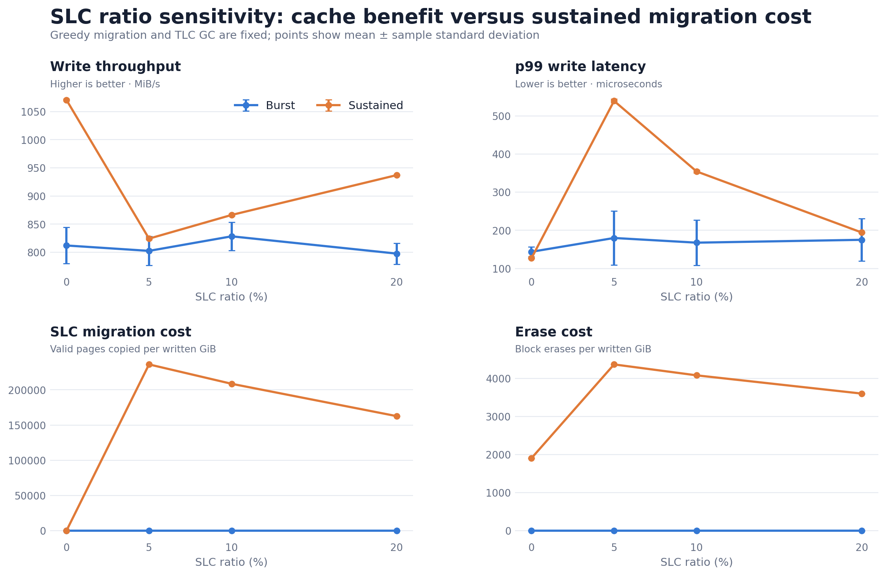
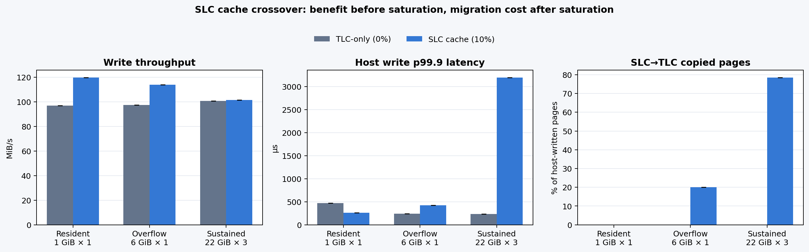
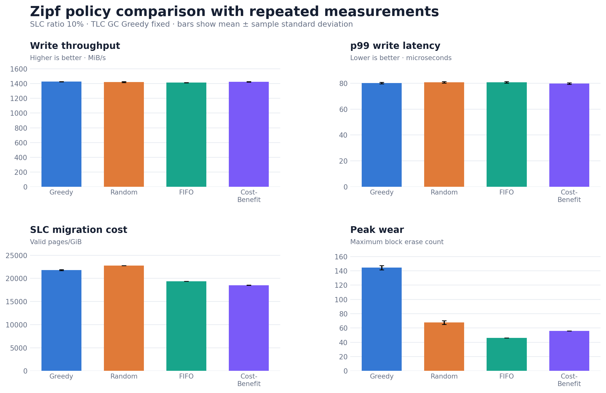
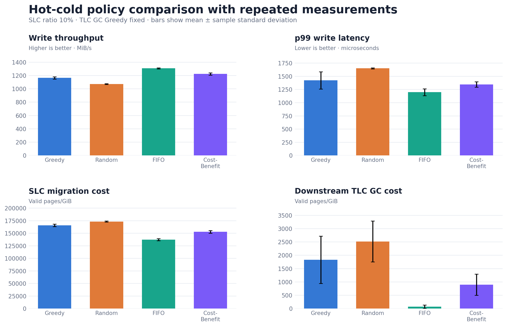
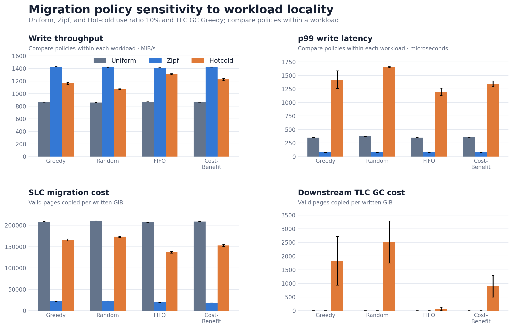

# 실습 2: NVMeVirt SLC Cache 구현 및 Migration 정책 분석

**유형진 (인턴)** · 2026년 8월 28일

> Word 문서: [PRACTICE2_REPORT.docx](PRACTICE2_REPORT.docx)

## 1. 실습 목표

본 실습은 NVMeVirt Conventional FTL에 SLC cache를 추가하고, cache가 가득 찼을 때 SLC 데이터를 TLC로 이동하는 구조와 victim 정책을 구현·평가하는 것을 목표로 한다.

- 전체 SSD를 설정 가능한 SLC/TLC line pool로 분할하고, host write를 SLC에서 우선 처리한다.
- SLC 공간이 부족하면 valid page를 TLC로 옮긴 뒤 SLC line을 회수하며, Greedy·Random·FIFO·Cost-Benefit 정책을 지원한다.
- TLC-only와 비교해 SLC가 유리한 짧은 write 구간과 migration으로 불리해지는 sustained 구간을 확인하고, 접근 지역성에 따른 정책 효과를 비교한다.

평가는 host throughput과 latency뿐 아니라 SLC migration page, downstream TLC GC page, erase 횟수를 함께 사용한다. 핵심 질문은 “SLC가 항상 빠른가”가 아니라 **어떤 workload 구간에서 이득이 유지되고, 언제 migration 비용이 이득을 넘어서는가**이다.

## 2. 구현 내용

### 2.1 SLC/TLC 구조와 I/O 경로

`slc_cache_ratio_percent` 모듈 파라미터로 SLC 비율을 0~20% 범위에서 선택하도록 했다. 초기화 시 전체 line을 SLC와 TLC pool로 고정 분할하고, 두 pool은 별도의 line manager와 write pointer를 사용한다. `ratio=0`이면 기존 TLC-only 경로가 사용된다.

| 구성 | 구현 |
|---|---|
| Host write | SLC가 있으면 `slc_wp`, TLC-only이면 `tlc_wp` 사용 |
| Internal write | SLC migration과 TLC GC 모두 `tlc_gc_wp` 사용 |
| Read/mapping | 공통 mapping table을 유지하고 PPA의 pool에 따라 SLC/TLC timing 적용 |
| Program unit | TLC 32 KiB, SLC 16 KiB oneshot page |
| Timing | SLC program latency는 TLC의 1/3, read도 SLC 전용 latency 적용 |

Overwrite 시 기존 PPA를 invalid 처리한 뒤 공통 mapping과 reverse mapping을 새 PPA로 갱신한다. 따라서 migration 전에는 SLC의 최신 page를, migration 후에는 TLC로 옮겨진 page를 동일한 read 경로에서 읽을 수 있다.

### 2.2 SLC-to-TLC migration과 victim 정책

SLC free line이 없으면 victim의 valid page만 SLC에서 읽어 TLC에 기록하고 mapping을 갱신한다. 복사가 끝난 SLC line은 erase 후 free list로 돌아간다. Destination TLC 공간이 부족한 victim은 제외하고, migration 뒤에도 TLC GC 한 line을 수행할 여유를 남기는 reserve admission control을 적용했다.

| 정책 | 선택 기준 | 의도 |
|---|---|---|
| Greedy | valid page 수(`vpc`) 최소 | 현재 migration 복사량 최소화 |
| Random | 적합한 후보 중 균등 무작위 | 선택 편향 제거 |
| FIFO | 가장 먼저 닫힌 line | 오래된 line을 단순하고 재현 가능하게 회수 |
| Cost-Benefit | invalid 비율과 age 결합 | 복사 비용과 line age를 함께 고려 |

Cost-Benefit 점수는 다음과 같다.

\[
\text{score} = \frac{ipc \times age}{2 \times vpc}, \qquad age = cb\_clock - mtime
\]

`vpc=0`인 line은 즉시 최우선으로 처리한다. Age에 따라 후보 순서가 계속 변하므로 오래된 heap root를 그대로 쓰지 않고, 선택 시점마다 현재 점수를 다시 계산한다.

### 2.3 통계와 데이터 무결성 검증

기존 `gc_policy`는 TLC GC 전용으로 유지하고, `slc_migration_policy`를 별도 파라미터로 추가했다. `/proc/nvmev/debug`에는 host/internal I/O를 SLC/TLC별로 나눈 counter, SLC migration 및 TLC GC page, block erase count를 노출했다.

모든 기능 실험에서 fio error는 0이었으며, 네 migration 정책 모두 migration과 TLC GC가 발생하는 CRC32C read-back 검증을 데이터 불일치 없이 통과했다.

## 3. 실험 방법

### 3.1 환경과 공통 절차

| 항목 | 설정 |
|---|---|
| 서버 | Linux kernel 6.18, GCC 15 |
| 가상 SSD | `memmap_start=16G`, `memmap_size=48G`, `cpus=7,8` |
| 노출 용량 / 파일시스템 | 약 44.86 GiB / ext4 |
| 기본 I/O | fio, `libaio`, `direct=1`, 4 KiB, `iodepth=16` |
| SLC ratio | 0%, 5%, 10%, 20% |
| TLC GC policy | Greedy 고정 |
| SLC migration policy | Greedy, Random, FIFO, Cost-Benefit |

정책과 ratio를 바꾸는 모든 비교는 `umount → rmmod → insmod → mkfs → mount → counter reset` 순서로 독립 실행했다. 파일시스템만 재생성하면 write pointer와 line 상태가 남기 때문에 모듈까지 다시 적재해 각 run의 초기 상태를 통제했다.

### 3.2 실험 구성과 지표

| 목적 | 구성 | 반복 |
|---|---|---:|
| 기능 검증 | SLC-only 64 MiB, overflow 6 GiB write/read | 각 1회 |
| Ratio 민감도 | Greedy, ratio 0/5/10/20%, burst 1 GiB 및 sustained 154 GiB | 각 3회 |
| Crossover | ratio 0/10%, resident 1 GiB·overflow 6 GiB·sustained 66 GiB | 각 1회 |
| Policy 비교 | 네 정책, Zipf:1.2 및 Hot-cold | 각 3회 |
| Workload 민감도 | 네 정책, Uniform random write | 각 3회 |

기본 확장 실험은 `write_early_completion=1`, `iodepth=16`이다. Crossover는 SLC media latency와 migration stall을 직접 드러내기 위해 `write_early_completion=0`, `iodepth=1`로 수행했다. 따라서 두 실험군의 절대 throughput은 직접 비교하지 않고 각 실험군 안의 TLC-only 대비 상대 차이를 해석한다.

주요 지표는 throughput, 평균/p99 latency, crossover의 p99.9 latency, migrated valid pages/GiB, TLC GC copied pages/GiB, erase/GiB와 peak erase다. 시간 기반 Hot-cold 결과는 정책별 기록량 차이를 보정하기 위해 written GiB로 정규화했다.

### 3.3 Workload 설계

각 workload는 SLC cache의 동작 구간과 migration 정책의 효과를 분리해서 보기 위해 다음과 같이 구성했다.

| Workload | 접근 패턴과 크기 | 확인 목적 |
|---|---|---|
| SLC-only | 64 MiB sequential write 후 동일 파일 4 KiB random read | Cache 용량 안에서 host read/write가 SLC에만 머무는지 검증 |
| Overflow | 6 GiB sequential write 후 동일 파일 random read | SLC 포화 후 migration과 TLC mapping/read 검증 |
| Ratio burst | 1 GiB 4 KiB uniform random write, 1회 | 짧은 write에서 ratio별 migration 발생 여부와 성능 비교 |
| Ratio sustained | 22 GiB uniform random write × 7회, 총 154 GiB | Cache를 반복 포화시켜 ratio별 migration·erase 비용 비교 |
| Crossover | Resident 1 GiB × 1, Overflow 6 GiB × 1, Sustained 22 GiB × 3 | 동일한 low-queue 조건에서 SLC 이득과 tail latency 역전 지점 확인 |
| Zipf | 22 GiB × 7회, `zipf:1.2`, `norandommap=1` | 일부 LBA가 반복 갱신되는 skew를 만들어 policy의 valid-page/age 선택 차이 관찰 |
| Hot-cold | 30 GiB cold fill 후 15 GiB cold touch와 1 GiB hot churn을 90초 동시 실행 | 수명이 다른 데이터가 공존할 때 migration과 downstream TLC GC 비교 |
| Uniform sensitivity | 22 GiB × 7회, uniform, `norandommap=1` | Locality가 없을 때 네 policy가 수렴하는지 확인 |

`norandommap=1`은 fio의 random map을 꺼 동일 LBA가 한 pass 안에서도 반복 선택될 수 있게 한다. Uniform과 Zipf는 `randrepeat=1`, 파일 크기 22 GiB, 총 write 154 GiB를 같게 두고 접근 분포만 바꿨다. Hot-cold에서는 cold touch와 hot churn 사이에 `stonewall`을 두지 않아 두 job이 90초 동안 함께 실행되며, 시간 기반이라 결과를 written GiB로 정규화했다. Crossover는 4 KiB uniform random write에 `numjobs=1`, `iodepth=1`, `write_early_completion=0`을 적용해 NAND program 및 migration stall이 host latency에 직접 드러나도록 했다.

## 4. 실험 결과

### 4.1 Baseline: TLC-only와 SLC cache

먼저 동일한 154 GiB sustained random write에서 ratio 0%와 10%를 비교했다. 이 단일 baseline은 SLC path의 초기 성능 방향과 내부 write traffic을 확인하기 위한 결과이며, ratio에 대한 반복 통계는 4.3절에서 별도로 제시한다.

| Ratio | BW (MiB/s) | Avg latency (us) | p99 (us) | SLC migrated pages |
|---:|---:|---:|---:|---:|
| 0% (TLC-only) | **1,351.3** | **46.0** | **146.4** | 0 |
| 10% (SLC) | 821.9 | 75.8 | 634.9 | 39,472,631 |

SLC-on에서는 host write 약 40.67M pages 중 39.47M pages가 TLC로 다시 이동했다. 즉 sustained 조건은 SLC의 빠른 program보다 거의 한 번 더 발생한 내부 복사 비용이 크게 작용해 throughput과 p99가 모두 악화됐다.

### 4.2 기능 검증

SLC-only와 overflow 실험에서는 성능 순위보다 host/internal I/O가 어느 media에서 발생했는지를 확인했다.

SLC 용량 안에서는 host read/write가 모두 SLC에서 처리되고 migration과 TLC GC는 발생하지 않았다.

Overflow에서는 SLC internal read와 TLC internal write가 같은 수로 증가하고, 이후 host read 일부가 TLC에서 처리됐다.

| 검증 조건 | 핵심 관찰값 | 판정 |
|---|---|---|
| SLC-only 64 MiB | Host write SLC 16,384 pages, TLC 0 | 모든 write가 SLC에 기록 |
| SLC-only read | Host read SLC 16,392 pages, TLC 0 | SLC-resident mapping/read 정상 |
| SLC-only background | Migration 0, internal write 0, TLC GC 0 | Cache 이내에서는 reclaim 없음 |
| Overflow 6 GiB | Migration 1,476회, valid page 566,781개 이동 | SLC 공간 부족 시 migration 발생 |
| Overflow internal I/O | SLC internal read와 TLC internal write가 모두 566,781 pages | SLC-to-TLC 복사 counter 일치 |
| Overflow read | Host read SLC 1,096,784, TLC 476,118 pages | Migration 이후 TLC mapping/read 정상 |

이 결과로 `SLC write → SLC-to-TLC migration → TLC read` 경로와 media별 counter가 의도대로 동작함을 확인했다. TLC GC가 0인 overflow 실험에서 internal TLC write가 migration page와 정확히 일치하므로 두 reclaim 원인도 분리된다.

### 4.3 SLC가 유리한 구간과 crossover

먼저 SLC 크기가 burst와 sustained write에 미치는 영향을 ratio 0/5/10/20%에서 비교했다.

| Ratio | Sustained BW (MiB/s) | p99 (us) | SLC migrated pages/GiB | Erase/GiB |
|---:|---:|---:|---:|---:|
| 0% | **1,070.8 ± 1.4** | **126.8 ± 0.6** | 0 | **1,904.7 ± 0.0** |
| 5% | 824.2 ± 2.0 | 539.3 ± 4.7 | 236,112 ± 11 | 4,365.3 ± 0.1 |
| 10% | 866.3 ± 1.7 | 354.3 ± 4.1 | 208,612 ± 157 | 4,078.5 ± 1.8 |
| 20% | 937.1 ± 0.8 | 194.2 ± 1.2 | 162,687 ± 50 | 3,599.6 ± 0.4 |

Burst에서는 migration이 없었고 ratio별 성능 차이는 표준편차 범위와 겹쳤다. Early completion과 queueing이 media latency 차이를 가린 결과다. Sustained에서는 SLC가 커질수록 migration과 erase 비용이 줄어 성능이 회복됐지만, 모든 SLC ratio가 TLC-only보다 불리했다.

직접적인 SLC 이득과 tail latency 전환은 early completion을 끈 crossover에서 확인했다.

| Phase | SLC BW 변화 | SLC p99.9 변화 | Migration/host write | Erase cost |
|---|---:|---:|---:|---:|
| Resident 1 GiB | **+23.5%** | **−44.3%** | 0% | 동일 |
| Overflow 6 GiB | +16.9% | **+76.2%** | 20.1% | 동일 |
| Sustained 66 GiB | +0.6% | **13.6배** | 78.5% | **3.43배** |

Resident에서는 SLC가 throughput과 p99.9를 모두 개선했다. Overflow부터 평균 성능 이점은 남아 있어도 migration stall 때문에 p99.9가 역전됐고, sustained에서는 throughput 이점이 사라진 반면 tail latency와 erase 비용이 크게 증가했다. Migration event가 전체 요청의 1%보다 드물어 p99에는 충분히 드러나지 않으므로 이 경계 분석에는 p99.9를 사용했다.

### 4.4 Migration policy 비교

Zipf에서는 네 정책의 host 성능 차이가 약 1%였지만 내부 복사량과 peak wear가 달랐다.

| Policy | BW (MiB/s) | SLC pages/GiB | Peak erase |
|---|---:|---:|---:|
| Greedy | 1,426.4 ± 1.5 | 21,808 ± 126 | 144.3 ± 3.1 |
| Random | 1,419.5 ± 7.1 | 22,770 ± 19 | 67.7 ± 2.5 |
| FIFO | 1,412.0 ± 1.7 | 19,356 ± 2 | **46.0 ± 0.0** |
| Cost-Benefit | 1,423.1 ± 2.4 | **18,540 ± 10** | 56.0 ± 0.0 |

Cost-Benefit은 Greedy보다 약 15.0% 적은 page를 이동했고, FIFO는 peak erase를 가장 낮췄다. 모든 run에서 TLC GC copied page가 0이므로 이 차이는 SLC migration victim 선택의 직접적인 효과다.

Hot-cold에서는 victim 정책이 이후 TLC 배치와 GC 비용까지 바꾸면서 host 성능 차이로 확대됐다.

| Policy | BW (MiB/s) | p99 (us) | SLC pages/GiB | TLC GC pages/GiB | Peak erase |
|---|---:|---:|---:|---:|---:|
| Greedy | 1,164.5 ± 16.2 | 1,422.7 ± 164.1 | 165,728 ± 2,593 | 1,829 ± 887 | 38.3 ± 0.6 |
| Random | 1,072.1 ± 5.4 | 1,652.1 ± 9.5 | 173,310 ± 1,190 | 2,519 ± 769 | 37.3 ± 2.1 |
| FIFO | **1,308.4 ± 7.6** | **1,198.8 ± 66.2** | **137,139 ± 2,152** | **70 ± 64** | **25.3 ± 0.6** |
| Cost-Benefit | 1,224.5 ± 17.3 | 1,346.2 ± 52.7 | 152,816 ± 2,763 | 898 ± 394 | 32.0 ± 1.0 |

FIFO는 Greedy보다 throughput이 12.4% 높고 p99가 15.7% 낮았으며, SLC migration·TLC GC copy·peak erase를 모두 최소화했다. Cost-Benefit이 그 다음이었고 Random은 성능과 복사 비용에서 가장 불리했다.

### 4.5 Workload 민감도

Uniform에서는 정책 간 throughput과 SLC copy 범위가 각각 1.46%, 1.58%에 그쳤다. Zipf에서는 host 성능은 비슷해도 Cost-Benefit과 FIFO가 내부 비용을 줄였고, 명확한 hot/cold locality에서는 FIFO의 우위가 host throughput과 tail latency까지 확대됐다. 즉 **locality가 강할수록 migration policy가 활용할 victim 간 age·valid-page 차이도 커진다.**

## 5. 종합 분석과 한계

### 5.1 핵심 해석

1. **SLC의 이득은 cache residency에 의존한다.** 짧은 write가 SLC 안에서 끝나면 낮은 media latency가 throughput과 p99.9를 함께 개선한다. Cache를 넘기 시작하면 평균 throughput보다 먼저 tail latency가 악화된다.
2. **큰 SLC는 손실을 늦출 뿐 sustained migration을 제거하지 못한다.** Ratio 5%에서 20%로 늘리면 migration과 erase 비용은 감소하지만 TLC-only보다 여전히 불리했다.
3. **정책 효과는 workload locality에 의존한다.** Uniform에서는 네 정책이 수렴했지만 Zipf에서는 Cost-Benefit이 migration 비용을, Hot-cold에서는 FIFO가 SLC/TLC reclaim 비용과 host 성능을 개선했다.
4. **Migration 횟수보다 copied page와 downstream cost가 중요하다.** Victim을 자주 회수해도 매번 복사하는 valid page가 적으면 총 비용은 낮다. 또한 SLC에서 옮긴 데이터의 배치가 이후 TLC GC와 peak wear까지 바꾼다.

본 실험 조건에서의 실용적인 선택은 다음과 같다.

- locality가 약하면 정책 차이가 작으므로 단순한 정책으로도 충분하다.
- Zipf형 skew에서 migration write amplification 최소화가 목적이면 Cost-Benefit이 유리하다.
- 명확한 hot/cold workload에서 성능·tail·마모를 함께 보면 FIFO가 가장 좋은 종합 trade-off를 보였다.

### 5.2 한계

Ratio 및 policy 비교는 각 조건을 3회 반복했지만 crossover는 시간 제약으로 각 조건을 1회만 수행했다. 따라서 resident 이득과 sustained 악화의 방향은 명확하나 p99.9의 절대값과 정확한 전환 지점은 추가 반복이 필요하다.

기본 확장 실험과 crossover는 early completion 및 iodepth가 다르므로 절대 throughput을 서로 비교하지 않았다. TLC GC 정책은 Greedy로 고정했으며, 결과는 NVMeVirt timing model에서 얻은 값이므로 실제 SSD firmware의 병렬성, thermal throttling, background task를 모두 반영하지 않는다.

## 6. 결론

본 실습에서는 NVMeVirt에 설정 가능한 SLC/TLC pool, 공통 mapping 기반 read, SLC-to-TLC migration, 네 가지 victim 정책과 분리된 계측 체계를 구현했다. SLC-only와 overflow 및 CRC 검증으로 기능과 데이터 무결성을 확인했다.

실험 결과 SLC는 resident 1 GiB write에서 TLC-only보다 throughput을 23.5% 높이고 p99.9를 44.3% 낮췄다. 그러나 overflow부터 tail latency가 역전됐고, sustained에서는 throughput 이점이 사라지는 반면 p99.9는 13.6배, erase 비용은 3.43배가 됐다. 따라서 SLC cache 평가는 평균 throughput뿐 아니라 cache residency, p99.9 tail, migration write amplification을 함께 봐야 한다.

정책 비교에서는 Zipf에서 Cost-Benefit이 migration page를 최소화하고 FIFO가 peak wear를 최소화했다. Hot-cold에서는 FIFO가 SLC migration과 downstream TLC GC 비용을 함께 줄여 가장 좋은 종합 성능을 보였다. 반면 Uniform에서는 정책 차이가 작았다. 결론적으로 최적 migration 정책은 고정된 하나가 아니라 workload locality와 평가 목표에 따라 달라진다.
