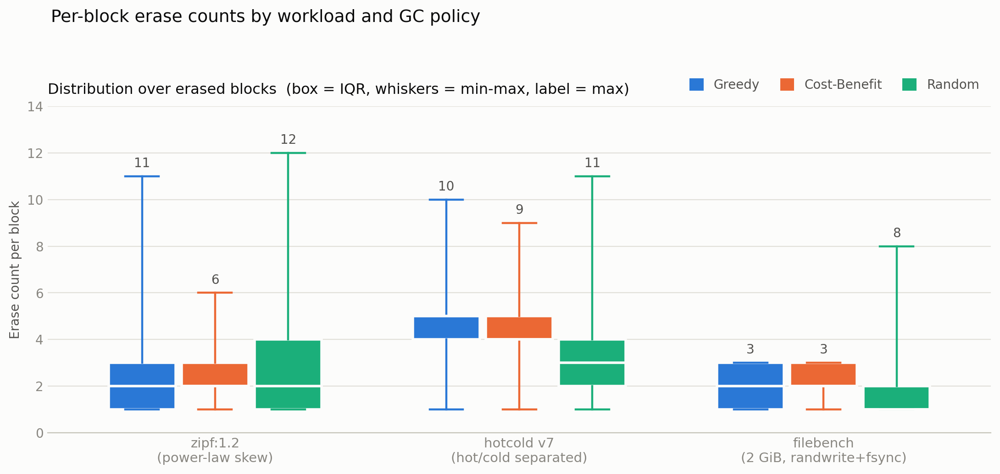
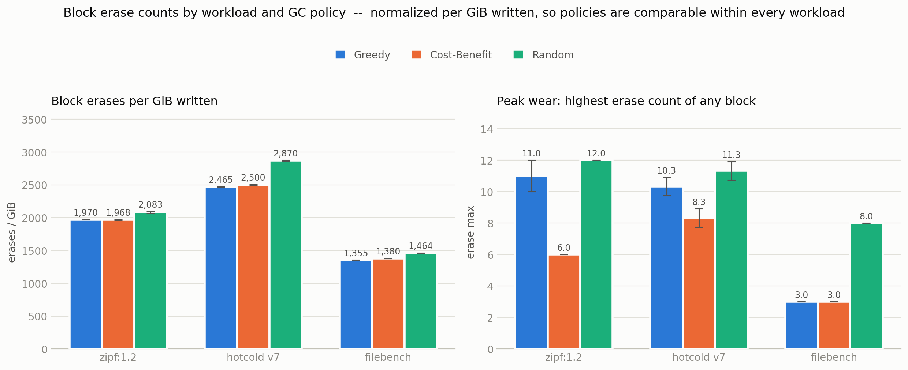
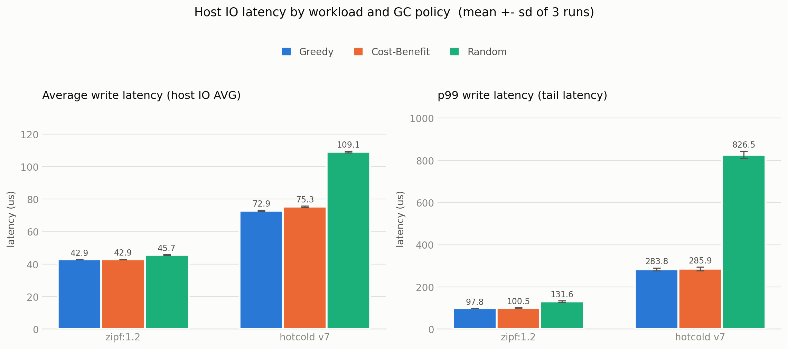
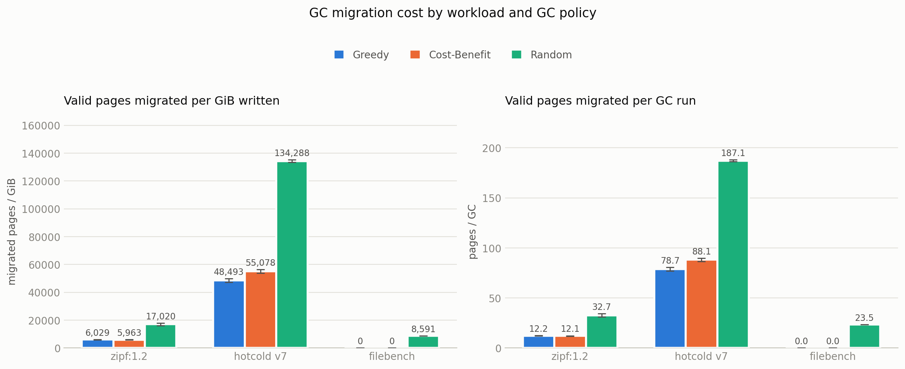
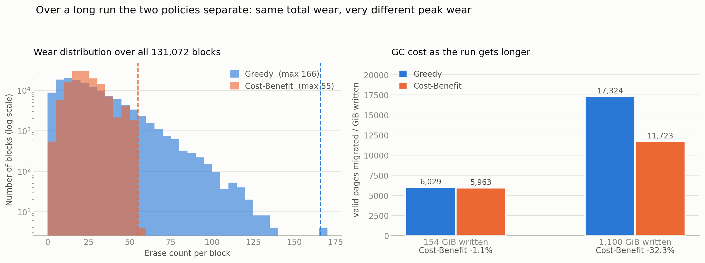
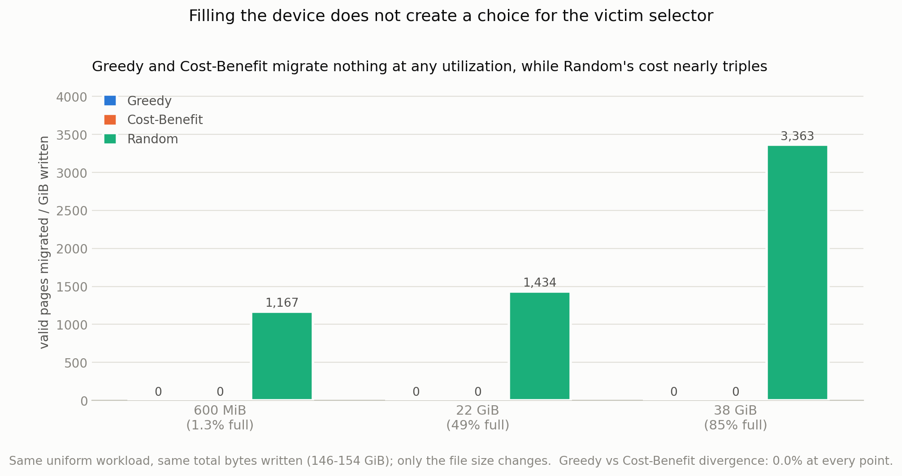

# 실습 1: NVMeVirt Cost-Benefit GC 구현 및 성능 분석

## 1. 실습 목표

NVMeVirt(가상 NVMe SSD 커널 모듈)의 Conventional FTL에서 GC victim 선택 정책 세 가지를 구현하고 비교한다.

FTL은 로그 구조로 동작하므로 덮어쓰기가 발생하면 기존 페이지는 무효(invalid)가 되고 새 페이지가 다른 위치에 쓰인다. 무효 페이지가 쌓이면 GC가 line 하나를 골라 남아있는 valid page를 다른 곳으로 옮긴 뒤 블록을 지워 공간을 회수한다. 이때 **어떤 line을 고르는가**가 GC 정책이다.

1. **Greedy** (기존 구현) — valid page 수(`vpc`)가 가장 적은 line을 선택. 옮길 페이지가 가장 적으므로 회수 비용이 최소다.
2. **Random** — 후보 중 무작위로 선택.
3. **Cost-Benefit** — 고전적인 정의는 이용률 `u`(line 안에서 valid page가 차지하는 비율)에 대해 `(1 − u) × age / (2u)`가 가장 큰 line을 선택하는 것이다. 비용(옮길 페이지 수)뿐 아니라 **얼마나 오래 방치됐는가**까지 고려해, 오래된 콜드 데이터를 담은 line을 우선 회수하는 것이 목표다.

   구현에서는 이 식을 페이지 개수로 바꿔 계산했다. line 하나의 페이지 수를 `P`라 하면 `u = vpc/P`, `1 − u = ipc/P`이므로 분자와 분모의 `P`가 약분되어 다음이 된다.

   ```
   (1 − u) × age / (2u)  =  (ipc × age) / (2 × vpc)
   ```

   여기서 `vpc`(valid page count)는 그 line에 아직 살아있는 페이지 수, `ipc`(invalid page count)는 무효화된 페이지 수이며 `vpc + ipc = P`다. 분모의 `2`는 원 논문의 정의를 그대로 따른 것으로, valid page를 **읽어서 다시 쓰는** 두 번의 접근 비용을 반영한다. 즉 표기만 다를 뿐 고전적인 Cost-Benefit 식과 동일하다.

세 정책을 여러 워크로드에서 실행해 **블록별 erase 횟수**, **호스트 IO 평균 지연시간**, **tail latency(p99)** 를 비교한다.

## 2. 구현 내용

### 2.1 정책 선택

모듈 파라미터 `gc_policy`(0=Greedy, 1=Random, 2=Cost-Benefit)로 정책을 지정한다. `insmod` 시점에만 지정할 수 있도록 런타임 읽기 전용(`0444`)으로 두었다. 실행 중 정책을 바꾸면 (a) 이전 정책이 남긴 FTL 내부 상태를 물려받아 비교가 오염되고, (b) Cost-Benefit에서 Greedy로 바꿀 경우 우선순위 큐가 Cost-Benefit 기준으로 정렬된 상태라 Greedy가 최소 vpc가 아닌 line을 **에러 없이 조용히** 회수하게 되기 때문이다.

### 2.2 Random 정책

victim 후보는 이진 힙 기반 우선순위 큐(`pqueue`)로 관리된다. 우선순위 값 자체를 무작위화하면 힙 불변식이 깨지므로, `select_victim_line()`에서 힙 배열(`pq->d[]`)의 무작위 인덱스를 뽑아 `pqueue_remove()`로 꺼내는 방식으로 구현했다.

### 2.3 Cost-Benefit 정책

`struct line`에 `mtime` 필드를 추가하고, 페이지를 쓸 때마다 증가하는 전역 논리 클럭 `cb_clock`을 두어 line이 닫히는 시점의 값을 기록했다. `age = cb_clock - mtime`이 된다. 실제 시각(`ktime_get_ns()`) 대신 논리 클럭을 쓴 이유는 스케줄링이나 서버 부하에 영향받지 않아 반복측정이 재현되기 때문이다.

우선순위 계산에서 두 가지를 처리했다.

- **`vpc == 0` 처리**: 이미 완전히 무효화된 line은 나눗셈 없이 곧바로 최우선 victim으로 반환한다. 나눗셈을 그대로 두면 0으로 나누어 커널 패닉이 발생한다.
- **방향 반전**: `pqueue`는 값이 작을수록 먼저 뽑히는 min-heap인데 Cost-Benefit 점수는 클수록 좋은 victim이므로, `CB_PRI_MAX - bc`로 뒤집어 반환한다.

### 2.4 구현 중 발견한 힙 문제

초기 구현은 우선순위 계산식만 바꾸고 `pqueue_pop()`으로 힙의 최상단을 꺼내는 방식이었다. 그런데 여러 워크로드에서 Greedy와 Cost-Benefit의 결과가 계속 거의 동일하게 나왔다.

원인은 이진 힙의 동작 방식에 있었다. Cost-Benefit 점수는 `age`를 포함하는데 `cb_clock`은 계속 증가하므로, **큐에 들어있는 line들의 실제 우선순위 순서가 시간이 지나면서 바뀐다.** 반면 이진 힙은 노드가 삽입·삭제될 때 그 노드의 조상 경로만 재정렬할 뿐, 큐 전체를 다시 검증하지 않는다. 따라서 오래 방치된 line들 사이의 순서가 실제로는 역전됐는데도 힙에 반영되지 않아, 최상단이 그 순간의 최적 victim이 아닐 수 있다.

`pqueue` 알고리즘을 그대로 옮긴 시뮬레이션으로 line 두 개짜리 최소 예제에서도 이 현상이 재현되고 스스로 교정되지 않음을 확인했으며, 실제 커널에 임시 카운터를 넣어 측정한 결과 전체 GC 판정의 약 5.5%에서 선택이 달라졌다.

**해결**: Cost-Benefit일 때는 `pqueue_pop()` 대신 매 GC마다 큐 전체를 스캔해 그 순간의 최적 line을 찾아 `pqueue_remove()`로 꺼내도록 수정했다. GC는 페이지 쓰기에 비해 드물게 일어나므로 이 방식의 오버헤드는 감당 가능한 수준이다.

## 3. 실험 방법

### 3.1 환경

실습 서버(커널 6.18, gcc 15)에서 `memmap_start=16G memmap_size=48G cpus=7,8`로 모듈을 적재했다. 노출 용량은 약 44.86 GiB이며, 가상 디바이스는 `/dev/nvme1n1`에 생성된다.

**정책마다 모듈을 완전히 리로드(`rmmod` → `insmod`)한 뒤 파일시스템도 새로 생성(`mkfs`)했다.** `cb_clock`, write pointer, free line list 같은 FTL 내부 상태는 파일시스템을 다시 만들어도 초기화되지 않고 모듈 리로드로만 지워지기 때문이다. 이 절차를 거치지 않으면 뒤에 실행한 정책이 앞 정책이 남긴 물리 상태를 물려받아 비교가 오염된다.

### 3.2 워크로드

모두 4KB 랜덤쓰기이며, fio는 `--direct=1`로 페이지 캐시를 우회한다.

| 워크로드 | 설정 | 총 쓰기량 |
|---|---|---|
| **zipf:1.2** | 22 GiB 파일, `random_distribution=zipf:1.2` | 154 GiB |
| **zipf:1.2 (장기)** | 위와 동일 조건에서 반복 횟수만 7회 → 50회 | 1,100 GiB |
| **hotcold v7** | 콜드 파일(30 GiB) 순차 기록 후, 콜드 일부 재기록과 핫 파일(1 GiB) 반복 재기록을 90초간 동시 실행 | 정책별 102\~167 GiB |
| **uniform** | 600 MiB 파일 반복 덮어쓰기 (사용률 1.3%) | 146 GiB |
| **zoned 80:20** | zipf와 동일 조건, `random_distribution=zoned:80/20:20/80` | 154 GiB |
| **filebench** | 2 GiB 파일, 매 write마다 fsync, 120초 4스레드 | 정책별 87\~89 GiB |

zipf와 zoned는 파일 크기와 총 쓰기량을 같게 맞추고 **접근 분포만** 다르게 했다. uniform은 5장의 사용률 실험을 위해 파일 크기를 22 GiB(49%)와 38 GiB(85%)로 키운 조건도 함께 측정했으며, 이때도 총 쓰기량은 146\~154 GiB로 맞췄다.

zipf·hotcold·uniform은 각 정책 3회 반복 측정했고, zoned와 filebench는 1회 측정했다. 장기 zipf는 실행에 정책당 약 14분이 걸려 Greedy와 Cost-Benefit만 1회씩 측정했다(4.4절).

### 3.3 측정 지표

- **블록별 erase 횟수** — 커널의 `erase_cnt`를 `/proc/nvmev/debug`로 노출해 전체 131,072개 블록을 덤프하고, 총합·최댓값·분포를 집계했다. 벤치마크 시작 전 `reset`으로 초기화한다.
- **호스트 IO latency** — fio가 보고하는 write 평균 지연시간과 p99 tail latency.
- **GC migration 비용** (추가 지표) — victim이 확정될 때마다 그 line의 `vpc`를 누적하는 카운터를 추가했다. GC가 실제로 복사해야 하는 페이지 수다.
- **victim 선택 진단** (추가) — 매 GC마다 큐 전체를 스캔해 "Greedy라면 골랐을 line"과 "Cost-Benefit이라면 골랐을 line"을 각각 계산하고, 선택이 갈린 비율과 각각의 vpc를 누적한다. 읽기 전용이라 실제 GC 동작에는 영향을 주지 않는다.

### 3.4 결과의 신뢰성 검증

측정값을 해석하기 전에 세 가지를 따로 확인했다.

**정책이 의도한 line을 고르는가.** 커널이 집계한 `migration 총합 / GC 횟수`(실제로 회수된 victim의 평균 vpc)를, 진단 기능이 큐를 독립적으로 스캔해 계산한 값과 대조했다. Greedy로 구동한 3회 모두 "Greedy 이론값"과, Cost-Benefit으로 구동한 3회 모두 "Cost-Benefit 이론값"과 소수점 셋째 자리까지 일치했다. Random은 어느 쪽과도 일치하지 않아 무작위 선택이 정상 동작함을 보인다.

**GC가 데이터를 손상시키지 않는가.** victim 선택 로직을 수정했으므로 valid page가 남은 line을 잘못 회수하면 데이터가 깨질 수 있다. Cost-Benefit으로 8 GiB 파일에 48 GiB를 쓰며 각 블록에 CRC32C를 심고 전부 되읽어 검증한 결과(`fio --verify=crc32c`) **불일치 0건**이었다.

**집계가 물리 구조와 맞는가.** 디바이스는 131,072개 블록 / 32,768개 line(line 하나 = 블록 4개)으로 구성된다. uniform에서 측정된 erase 총합 271,620을 4로 나누면 line 회수 67,905회가 되는데, 커널이 독립적으로 센 GC 횟수와 정확히 일치했다.

## 4. 결과

세 정책(Greedy, Random, Cost-Benefit)을 세 워크로드에서 비교했다. 모든 수치는 정책마다 커널 모듈을 완전히 리로드하고 파일시스템을 새로 만든 상태에서 측정했으며, zipf와 hotcold는 3회 반복 평균(± 표준편차)이다.

hotcold와 filebench는 시간 기반 워크로드라 정책마다 실제로 쓴 데이터 양이 다르다(예: hotcold에서 Greedy 167 GiB, Random 102 GiB). 따라서 erase 횟수와 migration 비용은 **쓴 데이터 1 GiB당으로 정규화**해 비교한다. 정규화하지 않으면 처리량이 낮은 정책이 단지 적게 썼다는 이유로 좋아 보인다.

### 4.1 블록별 erase 횟수





| 워크로드 | 지표 | Greedy | Cost-Benefit | Random |
|---|---|---|---|---|
| **zipf:1.2** (3회) | GiB당 erase | 1,970 ± 3 | 1,968 ± 5 | 2,083 ± 13 |
| | 최대 erase | 11.0 ± 1.0 | **6.0 ± 0.0** | 12.0 ± 0.0 |
| **hotcold v7** (3회) | GiB당 erase | 2,465 ± 9 | 2,500 ± 8 | 2,870 ± 6 |
| | 최대 erase | 10.3 ± 0.6 | **8.3 ± 0.6** | 11.3 ± 0.6 |
| **filebench** (1회) | GiB당 erase | 1,355 | 1,380 | 1,464 |
| | 최대 erase | 3.0 | 3.0 | 8.0 |

(zipf와 hotcold는 정책마다 3회 반복해 평균 ± 표준편차로 적었고, filebench는 1회 측정이라 단일 값이다. 이하 표도 같다.)

**총 erase 횟수는 세 정책이 크게 다르지 않다.** 총량은 결국 "얼마나 썼는가"로 결정되기 때문이다. Random만 5~16% 많은데, valid page가 남은 line을 회수해 그만큼 추가 쓰기가 발생한 결과다.

**정책 차이는 최대 마모에서 드러난다.** zipf에서 Cost-Benefit은 가장 심하게 닳은 블록의 erase 횟수를 11.0에서 6.0으로 **45% 낮췄다.** 3회 반복 원시값이 Greedy `[10, 11, 12]`, Cost-Benefit `[6, 6, 6]`으로 겹치지 않는다. hotcold에서도 10.3 → 8.3으로 낮아졌으나 폭은 작다. filebench에서는 두 정책이 동일했다(3.0).

SSD는 블록마다 지울 수 있는 횟수에 한계가 있으므로, 총 erase가 같아도 특정 블록에 마모가 몰리면 그 블록이 먼저 수명을 다한다. 최대 마모를 낮춘다는 것은 이 관점에서 실질적인 개선이다.

**Random은 최대 마모마저 가장 나쁘다**(12.0 / 11.3 / 8.0). 무작위 선택은 마모를 넓게 퍼뜨리지만, 그 대가로 GC를 훨씬 자주 유발해 결국 특정 블록의 마모도 줄이지 못했다.

### 4.2 호스트 IO Latency



| 워크로드 | 지표 | Greedy | Cost-Benefit | Random |
|---|---|---|---|---|
| **zipf:1.2** (3회) | 평균 | 42.9 ± 0.1 μs | 42.9 ± 0.1 μs | 45.7 ± 0.2 μs |
| | p99 (tail) | 97.8 ± 0.0 μs | 100.5 ± 0.6 μs | **131.6 ± 2.9 μs** |
| **hotcold v7** (3회) | 평균 | 72.9 ± 0.4 μs | 75.3 ± 0.5 μs | **109.1 ± 0.5 μs** |
| | p99 (tail) | 283.8 ± 6.7 μs | 285.9 ± 8.6 μs | **826.5 ± 17.1 μs** |

**Greedy와 Cost-Benefit은 사실상 같다.** zipf 평균은 42.9 μs로 동일하고, p99만 2.8% 높다. hotcold도 차이가 1% 미만이다. 즉 4.1에서 확인한 마모 개선에 대해 **Cost-Benefit은 응답시간 대가를 치르지 않았다.**

**Random은 뚜렷하게 나쁘다.** hotcold p99가 826.5 μs로 Greedy의 **2.9배**다. valid page가 많이 남은 line을 회수하면서 GC 한 번이 오래 걸리고, 그 순간 도착한 요청이 그대로 tail을 만든다.

**tail이 평균보다 정책 차이를 잘 드러낸다.** zipf 평균은 42.9 / 42.9 / 45.7로 붙어 있지만 p99는 97.8 / 100.5 / 131.6으로 벌어진다. GC는 항상 일어나는 것이 아니라 간헐적으로 일어나므로, 평균에는 묻히고 상위 백분위에 나타난다.

> filebench는 세 정책 모두 평균 0.010 ms/op로 동일했고, 백분위(p99)를 제공하지 않아 표에서 제외했다. `--direct=1`로 디바이스에 직접 쓰는 fio와 달리 filebench 측정 경로에서는 GC 지연이 드러나지 않았다.

### 4.3 GC migration 비용 (추가 지표)

과제 요구 지표는 아니지만, 4.1의 마모 차이가 **어디서 왔는지** 설명하기 위해 GC가 실제로 옮긴 valid page 수를 함께 측정했다. GC는 victim line에 남아있는 valid page를 다른 곳으로 복사한 뒤에야 그 블록을 지울 수 있으므로, 이 값이 정책이 유발하는 실제 부담이다. 커널에 카운터를 추가해 victim이 확정될 때마다 그 line의 vpc를 누적했다.



| 워크로드 | 지표 | Greedy | Cost-Benefit | Random |
|---|---|---|---|---|
| **zipf:1.2** (3회) | GiB당 이동 페이지 | 6,029 ± 66 | **5,963 ± 102** | 17,021 ± 886 |
| | GC 1회당 | 12.2 ± 0.1 | 12.1 ± 0.2 | 32.7 ± 1.5 |
| **hotcold v7** (3회) | GiB당 이동 페이지 | **48,493 ± 1,302** | 55,078 ± 1,198 | 134,288 ± 954 |
| | GC 1회당 | 78.7 ± 1.8 | 88.1 ± 1.6 | 187.1 ± 0.9 |
| **filebench** (1회) | GiB당 이동 페이지 | **0** | **0** | 8,591 |
| | GC 1회당 | 0.0 | 0.0 | 23.5 |

**zipf에서 Cost-Benefit의 마모 개선은 공짜였다.** migration 비용이 Greedy보다 오히려 1.1% 적다(6,029 → 5,963, 반복 간 변동 범위 안). 최대 마모를 45% 낮추면서 비용을 늘리지 않았다.

**hotcold에서는 대가를 치렀다.** migration 비용이 13.6% 늘었다(48,493 → 55,078). 같은 마모 개선이라도 워크로드에 따라 대가가 "없음"에서 "13.6%"까지 달라진다.

**filebench에서는 Greedy와 Cost-Benefit 모두 0이다.** GC는 3만 번 가까이 돌았지만 옮길 valid page가 하나도 없었다 — 회수한 line이 전부 완전히 무효화된 상태였다는 뜻이다. 고를 것이 없었으므로 두 정책이 같은 결과를 낸 것이고, 이것이 4.1에서 filebench만 최대 마모가 동일했던 이유다.

**Random의 비용은 다른 정책과 자릿수가 다르다.** hotcold에서 GiB당 134,288 페이지로 Greedy의 2.8배다. victim을 무작위로 고르므로 valid page가 가득 남은 line도 그대로 회수하기 때문이며, 이것이 4.2에서 본 latency 악화의 직접적인 원인이다.

### 4.4 장기 정상상태 — 총 쓰기량을 7배로 늘리면

지금까지의 측정은 총 쓰기량이 146\~154 GiB 규모였다. 실제 SSD는 훨씬 오래 사용되므로, 정책 차이가 실행이 길어질수록 어떻게 변하는지 확인했다. 가장 뚜렷한 차이를 보인 zipf 조건(22 GiB 파일, `zipf:1.2`)을 그대로 두고 반복 횟수만 7회에서 50회로 올려 **총 1,100 GiB**를 기록했다. 파일 크기와 반복 횟수가 고정된 워크로드이므로 두 정책이 쓴 바이트는 정확히 같다(양쪽 모두 1,100.0 GiB). 정규화 없이 직접 비교할 수 있다.



| 지표 | Greedy | Cost-Benefit | 차이 |
|---|---|---|---|
| GiB당 이동 페이지 (GC 비용) | 17,324 | **11,723** | **−32.3%** |
| GiB당 erase | 2,810 | **2,751** | −2.1% |
| **최대 erase (peak wear)** | 166 | **55** | **−66.9%** |
| 블록당 평균 erase | 23.6 | 23.1 | −2.1% |
| erase 변동계수 | 0.725 | **0.417** | −42.6% |
| erase 80회 이상 블록 수 | 1,244 | **0** | — |
| latency 평균 | 47.0 μs | **44.0 μs** | −6.4% |
| latency p99 | 138.2 μs | **114.2 μs** | −17.4% |
| latency p99.9 | 383.0 μs | **179.2 μs** | −53.2% |
| 처리량 | 1,323 MiB/s | **1,412 MiB/s** | +6.7% |

**Cost-Benefit이 모든 지표에서 앞선다.** 4.3에서 관찰한 "마모 개선의 대가"가 여기서는 나타나지 않을 뿐 아니라 방향이 반대다. GC 비용이 32.3% 적고, 그 결과 응답시간과 처리량까지 함께 좋아졌다.

블록당 평균 erase는 23.6 대 23.1로 사실상 같은데 최댓값은 166 대 55다. **총 마모량은 같고 분포만 다르다**는 뜻이며, 그림 6 왼쪽이 이를 그대로 보여준다. Greedy는 80회 이상 닳은 블록이 1,244개까지 꼬리를 늘어뜨리는 반면 Cost-Benefit은 그런 블록이 하나도 없다.

**왜 실행이 길어져야 차이가 드러나는가.** 3.4절에서 도입한 진단 카운터가 원인을 직접 보여준다. `avg_greedy_vpc`는 "그 순간 Greedy가 고를 수 있는 가장 싼 line의 valid page 수", 즉 **회수 후보 풀에서 가장 싼 매물의 가격**이다.

| 실제 구동한 정책 | 가장 싼 후보의 vpc | GC 1회당 실제 이동 페이지 |
|---|---|---|
| Greedy | 24.66 | 24.66 |
| Cost-Benefit | **7.21** | 17.04 |

같은 워크로드인데도 **Cost-Benefit이 돌고 있을 때는 가장 싼 후보가 7.2페이지, Greedy가 돌고 있을 때는 24.7페이지다.** Greedy는 눈앞에서 가장 싼 line만 반복해서 회수하는 사이, valid page가 많이 남은 line(주로 오래된 콜드 데이터가 든 line)은 한 번도 선택받지 못하고 계속 쌓인다. 그 결과 후보 풀 전체의 vpc 분포가 위로 밀려 올라가 **자기가 앞으로 고를 매물을 스스로 비싸게 만든다.** Cost-Benefit은 age 항 덕분에 이렇게 정체된 line을 주기적으로 꺼내 순환시키므로 후보 풀이 계속 양극화된 상태로 유지된다. 실행이 짧으면 아직 회수되지 않은 line이 많아 이 차이가 누적될 시간이 없고, 그래서 154 GiB에서는 두 정책의 GC 비용이 1.1% 차이에 그쳤다(그림 6 오른쪽).

Cost-Benefit이 GC 1회당 17.04페이지를 옮기면서도 총비용이 더 적은 것은, GC 횟수 자체가 더 적기 때문이다(756,621회 대 772,731회). 비싼 line을 골라 한 번에 더 많이 정리하는 편이 결과적으로 이득이었다.

> 이 조건은 실행에 정책당 약 14분이 걸려 **각 1회만 측정**했다. 다만 같은 zipf 조건 3회 반복에서 최대 erase가 Greedy `[10, 11, 12]`, Cost-Benefit `[6, 6, 6]`으로 안정적이었던 것에 비추면, 166 대 55의 차이는 반복 간 변동으로 설명되는 범위를 크게 벗어난다. 시간 제약으로 Random은 이 조건에서 측정하지 않았다.

## 5. 분석 — Cost-Benefit의 이점은 언제 나타나는가

4장에서 Cost-Benefit의 효과는 워크로드마다 크게 달랐다. zipf에서는 최대 마모를 45% 낮췄고, hotcold에서는 19% 낮췄으며, filebench에서는 Greedy와 완전히 동일했다. 무엇이 이 차이를 만드는지 확인하기 위해, 매 GC마다 victim queue 전체를 스캔해 "Greedy라면 골랐을 line"과 "Cost-Benefit이라면 골랐을 line"을 각각 계산하는 진단 기능을 추가해 측정했다. 이 진단은 읽기 전용이라 실제 GC 동작에는 영향을 주지 않는다.

| 워크로드 | GC 횟수 | 두 정책의 선택이 갈린 비율 | Greedy가 고를 line의 vpc | CB가 고를 line의 vpc |
|---|---|---|---|---|
| **zipf:1.2** | 75,767 | **98.7%** | 5.95 | 12.12 |
| **hotcold v7** | 99,787 | **90.3%** | 54.32 | 88.12 |
| uniform (600 MiB, 1.3% 사용) | 67,905 | **0%** | 0.00 | 0.00 |
| uniform (22 GiB, 49% 사용) | 73,336 | **0%** | 0.00 | 0.00 |
| uniform (38 GiB, 85% 사용) | 74,638 | **0%** | 0.00 | 0.00 |
| zoned 80:20 | 73,187 | **0%** | 0.00 | 0.00 |
| filebench | 30,616 | **0%** | 0.00 | 0.00 |

**워크로드가 두 부류로 정확히 갈린다.** 아래 다섯 워크로드에서는 회수 후보의 vpc가 항상 0이었다. 완전히 무효화된 line만 후보에 있었다는 뜻이고, 두 정책 모두 그런 line을 최우선으로 회수하도록 구현되어 있으므로 **고를 여지 자체가 없었다.** 실제로 수십만 번의 GC에서 선택이 단 한 번도 갈리지 않았다. 반면 zipf와 hotcold에서는 vpc가 0이 아닌 후보가 존재했고, 선택이 90% 이상에서 갈렸다.

즉 **Cost-Benefit이 Greedy와 달라지려면 "아직 valid page가 남아있는 회수 후보"가 필요하다.** 그런 후보가 없으면 정책의 정교함과 무관하게 결과는 동일하다.

### 5.1 두 가지 다른 설명을 검증했으나 모두 아니었다

**첫 번째 설명 — 디바이스가 비어 있어서인가.** 가장 먼저 떠오르는 설명은 워킹셋 크기다. uniform(600 MiB)은 44.86 GiB 디바이스의 1.3%만 사용하므로, 디바이스가 사실상 비어 있어 회수할 때쯤이면 어느 line이든 이미 다 죽어 있었으리라는 것이다. 이 설명이 맞다면 디바이스를 채웠을 때 결과가 달라져야 한다. 워크로드와 총 쓰기량(146\~154 GiB)은 그대로 두고 파일 크기만 키워 확인했다.



**디바이스를 85%까지 채워도 결과는 같았다.** Greedy와 Cost-Benefit은 세 지점 모두 valid page를 하나도 옮기지 않았고, 선택도 한 번도 갈리지 않았다.

이 결과가 단순히 "GC가 돌지 않아서"가 아니라는 것은 Random이 보여준다. 같은 후보 풀에서 무작위로 고르는 Random의 migration 비용은 1,167 → 1,434 → 3,363으로 **2.9배 증가했다.** 디바이스가 차오르면서 GC는 실제로 어려워졌고 valid page가 남은 line도 늘어났다. 그럼에도 **가장 무효화가 많이 진행된 line을 고르는 Greedy는 언제나 완전히 죽은 line을 찾아냈다.**

**두 번째 설명 — 워크로드가 실은 균등 랜덤이 아니어서인가.** fio는 기본적으로 비트맵을 유지해 한 회차 안에서 각 블록을 정확히 한 번씩만 방문한다. 즉 균등 분포라 해도 실제로는 "매 회차마다 전체를 한 번씩 훑는 무작위 순열"이므로, 모든 페이지가 회차당 정확히 한 번 무효화되어 오래된 line이 반드시 완전히 죽게 되는 것 아닌가 하는 의심이 있었다. 이 경우 위 결과는 사용률과 무관하게 워크로드가 만들어낸 인위적 현상이 된다. `--norandommap`으로 비트맵을 끄고 파일 크기와 총 쓰기량(38 GiB × 4회 = 152 GiB)은 그대로 둔 채 다시 측정했다.

| 38 GiB 조건 (Greedy) | erase 총합 | erase가 발생한 블록 수 | GiB당 이동 페이지 | 선택이 갈린 비율 |
|---|---|---|---|---|
| random map 사용 (기본) | 298,740 | 104,348 | 0 | 0% |
| random map 미사용 | 302,724 | 109,040 | 0 | 0% |

**워크로드는 실제로 달라졌지만 결과는 같았다.** erase 총합이 1.3%, erase가 발생한 블록 수가 4.5% 늘어 비트맵을 끈 효과 자체는 분명히 나타났다. 그럼에도 Greedy와 Cost-Benefit은 여전히 valid page를 하나도 옮기지 않았고 선택도 한 번도 갈리지 않았다. 서로 독립적인 두 설명이 모두 기각된 셈이다.

### 5.2 정리

이 실험 범위에서 관찰된 바로는, Cost-Benefit의 이점이 나타나는 조건은 디바이스 사용률이 아니라 **회수 시점까지 valid 상태로 살아남는 데이터가 존재하는가**였다. 이 조건이 충족된 경우(zipf, hotcold) 두 정책의 선택이 갈리고 마모 분산 효과가 나타났으며, 충족되지 않은 경우(uniform, zoned, filebench) 정책과 무관하게 동일한 결과가 나왔다. 4장에서 zipf의 효과가 가장 크고 filebench에서 전혀 없었던 것도 이 기준으로 설명된다.

한편 이 조건이 충족되었을 때 **차이가 얼마나 커지는지는 실행 길이에 따라 달라진다.** 4.4절에서 확인했듯이, 같은 zipf 조건에서 총 쓰기량을 154 GiB에서 1,100 GiB로 늘리자 GC 비용 차이가 1.1%에서 32.3%로 벌어졌다. 즉 "선택의 여지가 있는가"가 차이의 **발생 조건**이라면, 실행 길이는 그 차이가 **누적될 시간**을 결정한다.

다만 이는 **본 실험에서 측정한 조건들에 한정된 관찰**이다. 검증한 범위는 단일 디바이스 구성(44.86 GiB, over-provisioning 고정)과 4KB 랜덤쓰기 계열 워크로드이며, 총 쓰기량은 대부분의 조건에서 146\~154 GiB, 가장 긴 조건에서 1,100 GiB였다. 다른 over-provisioning 비율이나 접근 크기에서도 같은 기준이 성립하는지는 확인하지 않았다.

## 6. 결론

**1. Cost-Benefit은 최대 마모를 낮춘다.** zipf에서 가장 심하게 닳은 블록의 erase 횟수를 11.0에서 6.0으로 **45% 줄였고**(3회 반복 원시값이 겹치지 않음), hotcold에서도 10.3에서 8.3으로 줄였다. SSD는 블록마다 지울 수 있는 횟수에 한계가 있으므로, 총 erase가 같아도 마모가 특정 블록에 몰리면 그 블록이 먼저 수명을 다한다. 최대 마모를 낮추는 것은 이 관점에서 실질적인 개선이다.

**2. 그 대가는 워크로드에 따라 다르며, 실행이 길어지면 대가가 아니라 이득이 된다.** 146\~154 GiB 규모에서는 zipf의 migration 비용이 1.1% 적어 사실상 공짜였고 hotcold에서는 13.6% 더 들었으며, 응답시간은 두 워크로드 모두 Greedy와 차이가 없었다(평균 동일, p99 3% 이내). 그러나 같은 zipf 조건에서 총 쓰기량을 1,100 GiB로 늘리자 **Cost-Benefit이 모든 지표에서 앞섰다** — GC 비용 32.3% 감소, 최대 마모 166에서 55로 감소, p99.9 latency 53% 감소, 처리량 6.7% 증가.

원인은 Greedy가 후보 풀을 스스로 악화시킨다는 데 있다. 가장 싼 line만 반복해서 회수하면 valid page가 많이 남은 line은 영원히 선택받지 못하고 쌓이므로, 시간이 지날수록 고를 수 있는 가장 싼 매물조차 비싸진다(가장 싼 후보의 vpc가 Cost-Benefit 구동 시 7.2인 반면 Greedy 구동 시 24.7). Cost-Benefit은 age 항으로 이렇게 정체된 line을 주기적으로 순환시켜 이를 막는다. 짧은 실행에서는 이 격차가 누적될 시간이 없어 드러나지 않는다.

**3. Random은 모든 지표에서 가장 나쁘다.** valid page 수를 전혀 고려하지 않아 아직 살아있는 페이지가 많은 line도 그대로 회수한다. 그 결과 migration 비용이 Greedy의 2.8배, hotcold p99 latency가 2.9배였으며, 마모를 넓게 퍼뜨림에도 최대 마모마저 가장 높았다.

**4. Cost-Benefit의 이점은 조건부다.** 측정한 일곱 조건 중 다섯(uniform 세 종류, zoned, filebench)에서 Greedy와 Cost-Benefit의 선택이 **단 한 번도 갈리지 않았고** 결과도 완전히 동일했다. 회수 후보가 전부 이미 무효화된 line이라 고를 여지가 없었기 때문이다. 디바이스를 85%까지 채워도 마찬가지였으므로 원인은 사용률이 아니며, **회수 시점까지 valid 상태로 살아남는 데이터가 존재하는지**가 조건이다.

**5. 구현 과정에서 이진 힙의 구조적 한계를 발견했다.** 시간에 따라 값이 변하는 우선순위를 이진 힙에 넣으면, 힙이 삽입·삭제 시 일부 경로만 재정렬하므로 최상단이 실제 최적값이 아닐 수 있다. 이 문제로 전체 GC 판정의 5.5%에서 잘못된 victim이 선택되고 있었고, Cost-Benefit일 때 큐 전체를 스캔하도록 수정해 해결했다. 수정 전에는 Cost-Benefit이 Greedy와 거의 같게 동작해 위의 차이가 측정에 드러나지 않았다.

## 부록 A. 구현한 코드

upstream 마지막 커밋 이후 변경분이다. 소스는 네 파일, 총 255줄 추가다.

| 파일 | 구분 | 추가/수정 내용 |
|---|---|---|
| `conv_ftl.c` | 수정 (+168) | `gc_policy` 모듈 파라미터(0444) · 전역 논리 클럭 `cb_clock` · `cb_victim_pri()` Cost-Benefit 점수 계산 · `victim_line_get_pri()` 정책별 우선순위 · `advance_write_pointer()`에서 `mtime` 스탬프 · `mark_page_invalid()`를 remove+insert로 교체 · `select_victim_line()` 정책별 분기(Random=무작위 인덱스, Cost-Benefit=큐 전체 스캔) · `do_gc()`에서 migration 카운터 누적 · `diag_scan_greedy_vs_cb()` 진단 |
| `conv_ftl.h` | 수정 (+13) | `struct line`에 `mtime` 필드 추가 · `gc_valid_page_migrate_cnt` 등 extern 선언 |
| `main.c` | 수정 (+83) | `__walk_conv_blocks()` 블록별 `erase_cnt` 순회(dump/reset) · `/proc/nvmev/debug` 읽기·쓰기 핸들러 연결 |
| `Kbuild` | 수정 (+4) | `CONFIG_NVMEVIRT_NVM` → `CONFIG_NVMEVIRT_SSD` (Conventional FTL 빌드) |
| `scripts/run_experiment.sh` | 신규 | fio 벤치마크 — 매 실행 모듈 리로드 + mkfs + 결과 수집 |
| `scripts/run_filebench_experiment.sh` | 신규 | filebench 벤치마크 |
| `scripts/collect_summary.sh` | 신규 | `results/` → CSV 집계 |
| `scripts/workloads/hotcold.fio` | 신규 | 핫/콜드 분리 워크로드 |
| `report/make_figures.py` | 신규 | 그림 생성 (`results/`에서 직접 계산) |

주요 함수의 역할은 다음과 같다.

| 함수 | 역할 |
|---|---|
| `cb_victim_pri()` | `(ipc × age) / (2 × vpc)` 계산. `vpc == 0`이면 0으로 나누기를 피해 즉시 최우선 victim 반환 |
| `victim_line_get_pri()` | 정책에 따라 `vpc`(Greedy) 또는 `CB_PRI_MAX - bc`(Cost-Benefit) 반환. min-heap이므로 Cost-Benefit은 부호를 뒤집는다 |
| `select_victim_line()` | Greedy는 `pqueue_pop()`, Random은 힙 배열의 무작위 인덱스, Cost-Benefit은 큐 전체 스캔 후 `pqueue_remove()` |
| `mark_page_invalid()` | 큐 안의 line 재정렬을 `pqueue_change_priority()` 대신 remove+insert로 수행 (파생 우선순위에서도 안전) |
| `diag_scan_greedy_vs_cb()` | 매 GC마다 두 정책의 선택을 독립 계산해 비교 (읽기 전용) |

## 부록 B. 재현 정보

### B.1 모듈 적재

```
make
sudo insmod ./nvmev.ko memmap_start=16G memmap_size=48G cpus=7,8 gc_policy=<0|1|2>
sudo mkfs -t ext4 -F /dev/nvme1n1
sudo mount /dev/nvme1n1 ~/nvme_mount
echo reset | sudo tee /proc/nvmev/debug
```

`gc_policy`는 런타임 읽기 전용이므로 정책을 바꾸려면 모듈을 다시 적재해야 한다. 측정 후 `cat /proc/nvmev/debug`로 블록별 `erase_cnt`와 진단 카운터를 덤프한다.

### B.2 fio 워크로드

**zipf** (zoned는 `--random_distribution`만 `zoned:80/20:20/80`으로 교체)

```
fio --name=gc_stress --filename=$MOUNT_DIR/testfile2 \
    --size=22G --rw=randwrite --bs=4k --numjobs=1 --iodepth=16 \
    --ioengine=libaio --direct=1 --loops=7 \
    --random_distribution=zipf:1.2 --group_reporting \
    --output-format=json
```

4.4절의 장기 정상상태 측정은 위와 동일하고 `--loops`만 `50`으로 바꾼 것이다(총 1,100 GiB).

**uniform** (사용률 스윕은 `--size`/`--loops`만 `22G`/`7`, `38G`/`4`로 교체)

```
fio --name=gc_stress --filename=$MOUNT_DIR/testfile2 \
    --size=600M --rw=randwrite --bs=4k --numjobs=1 --iodepth=16 \
    --ioengine=libaio --direct=1 --loops=250 --group_reporting \
    --output-format=json
```

**hotcold** (`scripts/workloads/hotcold.fio`, `COLD_SIZE=30G COLD_TOUCH_SIZE=15G HOT_SIZE=1G HOTCOLD_RUNTIME=90`)

```
[global]
ioengine=libaio
direct=1
bs=4k
iodepth=16
group_reporting=1

[cold_fill]                 # 콜드 파일을 순차로 한 번 채운다
filename=coldfile
rw=write
size=${COLD_SIZE}
stonewall

[cold_touch]                # 콜드 일부를 재기록해 GC 후보로 진입시킨다
filename=coldfile
rw=randwrite
size=${COLD_TOUCH_SIZE}
time_based=1
runtime=${HOTCOLD_RUNTIME}
stonewall

[hot_churn]                 # 위와 동시에 핫 파일을 반복 재기록한다
filename=hotfile
rw=randwrite
size=${HOT_SIZE}
time_based=1
runtime=${HOTCOLD_RUNTIME}
```

`cold_touch`와 `hot_churn` 사이에는 `stonewall`이 없어 두 작업이 같은 `runtime` 동안 병렬로 실행된다. 콜드 후보 공급이 중간에 끊기지 않도록 한 것이다.

### B.3 filebench 워크로드

ASLR을 끈 뒤(`echo 0 | sudo tee /proc/sys/kernel/randomize_va_space`) 실행한다.

```
set $dir=<마운트 경로>
set $filesize=2g
set $iosize=4k
set $nthreads=4

define file name=gcfile,path=$dir,size=$filesize,prealloc,reuse

define process name=filewriter,instances=1
{
  thread name=filewriterthread,memsize=10m,instances=$nthreads
  {
    flowop write name=write-file,filename=gcfile,random,iosize=$iosize
    flowop fsync name=sync-file,filename=gcfile
  }
}

run 120
```

### B.4 실행 스크립트

위 절차 전체(모듈 리로드 → mkfs → mount → 카운터 리셋 → 벤치마크 → 결과 수집)는 스크립트로 자동화되어 있다.

```
NVME_DEV=/dev/nvme1n1 MEMMAP_START=16G MEMMAP_SIZE=48G NVME_CPUS=7,8 \
  ./scripts/run_experiment.sh <policy 0|1|2> <label> <uniform|hotcold>
```

`UNIFORM_SIZE` / `UNIFORM_LOOPS` / `RANDOM_DIST` / `NORANDOMMAP` 환경변수로 파일 크기·반복 횟수·접근 분포·random map 사용 여부를 지정한다. 각 실행 결과는 `results/<타임스탬프>_policy<N>_<정책>_<라벨>/`에 `summary.txt`(집계 지표), `meta.txt`(실행 조건 전체), `fio.json`(원본 출력), `erase_cnt.txt`(블록별 erase 덤프)로 저장된다.

## 부록 C. 보고서에 싣지 않은 검토 사항

본문에 담기에는 분량이 늘어나 생략했지만, 결과에 이르는 과정에서 실제로 확인하고 해결한 것들이다. 전체 경위와 그때그때의 측정값은 저장소의 `EXPERIMENT_LOG.md`에 날짜순으로 기록해 두었다.

**1. 핫/콜드 워크로드를 일곱 번 재설계했다.** Cost-Benefit의 차이를 드러내려면 "오래 살아남는 데이터"가 필요한데, 이를 만들어내는 워크로드를 얻기까지 여러 번 실패했다. 콜드 파일을 한 번만 쓰면 그 line은 100% valid로 남아 victim 후보에 아예 들어가지 않았고(v1), 반대로 접근 스큐를 너무 강하게 주면 거의 무효화된 후보가 항상 대기해 age가 아무리 벌어져도 선택에 영향을 주지 못했다(v2). 콜드와 핫을 물리적으로 분리해도(v5) 결과는 같았다. 원인은 진단 출력을 시간순으로 보고서야 드러났다 — 콜드 쪽 부하가 핫 쪽보다 먼저 끝나 실행 후반 83% 구간에서는 핫 line끼리만 경쟁했고, 그래서 두 정책의 선택이 100% 일치하고 있었다(v6). 두 부하를 `time_based`로 같은 시간 동안 돌게 바꾼 v7에서야 선택 차이가 실행 끝까지 유지됐다. 본문 4장의 hotcold 결과는 이 v7이다.

**2. 정책마다 커널 모듈을 완전히 리로드해야 한다.** 처음에는 `mkfs`로 파일시스템만 다시 만들고 정책을 바꿔가며 이어서 측정했다. 그러나 `cb_clock`, write pointer, free line list 같은 FTL 내부 상태는 파일시스템과 무관하게 커널 메모리에 남아 있어, 뒤에 도는 정책이 앞 정책이 만들어 둔 물리 상태를 그대로 물려받는다. 완전히 리로드한 뒤 같은 정책을 단독으로 재측정했을 때 값이 크게 달라져 이 사실을 확인했고, 첫 3정책 비교 결과 전체를 폐기했다. 이후 모든 측정은 정책마다 `rmmod` → `insmod`부터 다시 시작한다.

**3. filebench 자체의 버그를 고쳐야 실행할 수 있었다.** 서버에 filebench를 설치하니 가장 단순한 워크로드에서도 시작하자마자 `buffer overflow detected`로 죽었다. 원인은 `fileset.c`의 `fileset_resolvepath()`가 `malloc(strlen(path) + 1)`로 문자열 길이에 딱 맞는 버퍼를 잡아놓고 복사할 때는 크기를 `MAXPATHLEN`(4096)으로 넘기는 것이었다. 이 코드는 오래전부터 있었지만 glibc 2.38이 `strlcpy`를 자체 제공하기 시작하면서 filebench의 관대한 자체 구현 대신 시스템 함수가 쓰이게 됐고, 여기에 컴파일러의 버퍼 크기 검사가 걸리면서 비로소 드러났다. 넘기는 크기를 실제 할당 크기로 맞춰 해결했다. 같은 패턴이 더 있는지 확인했으나 이 한 곳뿐이었다. (별개로 GCC 15가 `bool`을 예약어로 만들면서 이를 변수명으로 쓰는 filebench가 컴파일되지 않아, 이전 C 표준을 지정해 빌드했다.)

**4. `gc_policy`를 런타임에 바꿀 수 없도록 막았다.** 처음에는 `/sys/module/nvmev/parameters/gc_policy`로 정책을 즉시 바꿀 수 있게 해두었으나, 이것이 위험하다는 것을 뒤늦게 확인했다. Cost-Benefit으로 동작하는 동안 victim queue는 Cost-Benefit 우선순위로 정렬되어 있는데, 여기서 Greedy로 바꾸면 Greedy는 큐의 최상단을 그대로 신뢰하므로 valid page가 가장 적은 line이 아닌 엉뚱한 line을 회수하게 된다. **오류 메시지 없이 조용히 잘못 동작하고 힙이 스스로 복구되지도 않는다.** 모듈 파라미터를 읽기 전용(`0444`)으로 바꿔 적재 시점에만 지정할 수 있게 했다. 위 2번에서 확인한 상태 오염 문제까지 고려하면 어차피 정책마다 모듈을 다시 적재해야 하므로, 실험 절차에는 영향이 없다.
